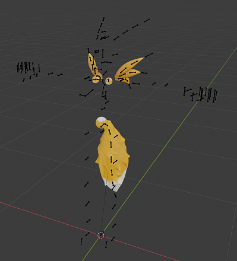
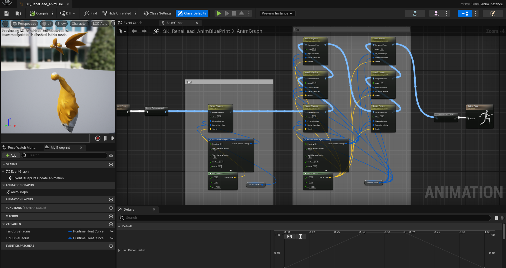

# Kawaii Physics for Player Model Swaps
Using Unreal Editors Compatible Skeletons to add Custom Bones and apply physics to them

- **Written by: `ReapersVigilance`**

#

# Overview

This guide is to show how to setup your model with UE's compatible skeletons to activate Kawaii physics and collision. **FOR CUSTOM ADDED BONES** 
####
I am assuming you understand the concept and setup of model swapping including the extraction from FModel, Importing to Blender, Weight painting, and Export from Blender. I will touch on them briefly however.
Other guides are quite detailed in doing all of the above.

I'm going to Write this as a full Model Swap however it can be done with just Hair/Head Models as long as you use a dummy SK_PalHuman_Skeleton in the proper folder.

process is very similar to a normal model swap except for some key differences in the Exporting from blender and UE work.

## Critical Notes
- This method works for adding physics to **CUSTOM BONES** in both Hair and Head Swaps. It does **NOT** work for adding physics bones to Outfit swaps. (Unless you like T-posing everywhere)So it works best doing them all together and choosing which Kawaii parts will be Hair and which will be Head.
- As long as you're adding physics to Default Bones on an Outfit, that'll work without the Compatible Skeletons. Can skip right to the Kawaii section for that.
####
This is absolutely not a replacement for the bone reorder and animation tool by **`Shifty`**
It just allows you to add physics to swaps without breaking the animations.

Can be used in combination with Jiggle Physics (18+) guide by **`Dytser`**

## Tools Needed

- FModel
- Blender
- UE 5.1
- Kawaii Physics plugin 1.10
- UnrealPak

## Preview
See **`Gif 01`** for a brief preview of what this guide accomplishes
<table>
<tr>
<th>Reference File Name/Description</th>
<th>Reference File</th>
</tr>
<tr>
<td>
  
  **Gif 01 - Preview**  
  
A preview of what will be done using this guide 

The Body/Arms/Legs/Head are an Outfit Swap   
The Ears are a Hair Swap  
The Tail and Spikes are a Head Swap

Note that the objects included in the  
Head and Hair Swaps have Enabled Physics
</td>
<td>
  
   

</td>
</tr>
</table>

#

# Full Process

## Step 1 _ (FModel and Blender) - `File Prep`
- Standard Model Swap process to begin
    - The Psk you will need to Export from FModel is the `SK_Player_Female` from the path `Pal/Content/Pal/Model/Character/Player/Body/Female` this comes with the SK_PalHuman_Skeleton we need
      - can be done with one of the outfit skeletons as well as they reference the same.
- Import this psk into blender along with the model you will be swapping.   **`SEE IMAGE 01`**
- From here is the same as a normal model swap with aligning your model and applying your model to the game skeleton.
<table>
<tr>
<th>Reference File Name/Description</th>
<th>Reference File</th>
</tr>
<tr>
<td>
  
  **Image_01 - Default**  
  
A preview of what will be done using this guide 

The Body/Arms/Legs/Head are an Outfit Swap   
The Ears are a Hair Swap  
The Tail and Spikes are a Head Swap

Note that the objects included in the  
Head and Hair Swaps have Enabled Physics
</td>
<td>
  
   

</td>
</tr>
</table>

## Step 2 _ (Blender) - `Add Bones and Painting`
- You can now add bones to the skeleton that will reference any part you want Kawaii Physics
    - Hair, Tail, Ears, Dangling parts, Whatever
    - Have the last bone of these parts off of the model. It helps for the physics later.  **`SEE IMAGE 02`**
    - ENSURE THESE BONES ATTACH TO OTHER BONES 
        - Example: parent the first bone of a hair chain to the head bone,  
            or parent the first tail bone to the spine_01 bone.
- Weight paint. 
    - Whether you do it manually or use Mesh Data Transfer from the original game model.   
        Tweak as necessary for your new bones.
     - That last bone thats slightly hanging off will need to influence the very tip of whatever part its attached it.
<table>
<tr>
<th>Reference File Name/Description</th>
<th>Reference File</th>
</tr>
<tr>
<td>
  
  **Image_02 - Custom Bones**  
  
An example of Custom added bones  
  
The 4 bone chain for the ears  
linked to the head bone  
  
The 3 bone chains for each spike  
linked to the clavicles  
  
The 7 bone chain for the tail  
linked to the spine
</td>
<td>
  
   

</td>
</tr>
</table>

- There is an in game bug regarding Mounted Combat that needs to be worked around at this point or it will affect everything from here on. **`SEE IMAGE 18`**
    - Any Custom added bones Above the Waist will error when aiming side to side while mounted. This has something to do with the animation lock of the root bone.
    - To Fix. all above waist added bones must use names of existing in game bones that are not being used by the Outfit Swap. 
        - All the Hair bones can be used to fix this **`SEE IMAGE 19`**
    - This bug persists on anything with applied physics even if not using Kawaii. ie. spring controllers for jiggle physics
        - I recommend repurposing the backpack bones as weight paint for breasts
<table>
<tr>
<th>Reference File Name/Description</th>
<th>Reference File</th>
</tr>
<tr>
<td>
  
  **Image_18 - Mounted_Bug**  
  
Shows the Bug of using custom bones while in mounted combat 

Notice the bone tree items marked RenaEar   

Even though im facing left of the mount  
The ears still pull straight back
</td>
<td>
  
   

</td>
</tr>
<tr>
<td>
  
  **Image_19 - Mounted_Bug_Fix**  
  
The fix 

Using the exxact same bones  
With identical weight paint  

Only difference if you look at the tree  
the bones are renamed to default hair bones
</td>
<td>
  
   

</td>
</tr>
</table>

## Step 3 _ (Blender) - `Dividing up the Model`
- You now need to split your model into the Necessary Parts that are going to be your *Outfit Swap*, *Head Swap*, and *Hair Swap*.
    - For my exaple the Ears are a *Hair Swap*, The Tail and Back spikes are a *Head Swap*, and Everything else is an *Outfit Swap* 
    - Keep in mind that some helmets overwrite the hair, so if you dont want your *Hair Swap* to disappear in those instances you can combine the *Hair Swap* and *Head Swap* into just a *Head Swap*.
- Keep in mind you only need to separate the meshes but everything can stay attached to the same Armature **`SEE IMAGES 03, 04, and 05`**
    - I added small spheres onto the connection bone as i occasionally had a bone error on importing to UE but it was not consistent. Those spheres stopped it completely.
- Export these as 3 separate FBX files with the armature in each one. just like the images.

<table>
<tr>
<th>Reference File Name/Description</th>
<th>Reference File</th>
</tr>
<tr>
<td>
  
  **Image_03 - Hair_FBX**  
  
This shows the active parts for the *Hair Swap*  
Make sure to select these and use Selected Only when exporting  

Ensure you armature is named *Armature*
</td>
<td>
  
   

</td>
</tr>
<tr>
<td>
  
  **Image_04 - Head_FBX**  
  
This shows the active parts for the *Head Swap*  
Make sure to select these and use Selected Only when exporting  

Ensure you armature is named *Armature*
</td>
<td>
  
   

</td>
</tr>
<tr>
<td>
  
  **Image_05 - Outfit_FBX**  
  
This shows the active parts for the *Outfit Swap*  
Make sure to select these and use Selected Only when exporting  

Ensure you armature is named *Armature*
</td>
<td>
  
   

</td>
</tr>
</table>

## Step 4 _ (UE) - `Import Setup`
- UE folder setup is the same as any normal model swap as well as all your cooking settings  **`SEE IMAGE 06`**
     - I am only doing an *Outfit Swap* of the Old Cloth in this example, If you're doing other outfits then you'll need those too.
     - note that the *Hair Swap* and *Head Swap* can be done with any head and hair, not just 001 as i am showing here

<table>
<tr>
<th>Reference File Name/Description</th>
<th>Reference File</th>
</tr>
<tr>
<td>
  
  **Image_06 - File_Structure**  
  
The Standard Model Swap file structure 
  
More or Differnt Folders may be required for your specific swap  
  
Adjust as required
</td>
<td>
  
   

</td>
</tr>
</table>

## Step 5 _ (UE) - `Import Outfit FBX`
- Standard model swap applies here
- Import your FBX into the folder `SK_Player_Female_Outfit_OldCloth001`
    - Rename `Skeleton` to `SK_PalHuman_Skeleton`, and move to the Human Folder  **`SEE IMAGE 07`**
    - Rename `Physics Asset` to `SK_Player_Female_PhysicsAsset`, and move to the Female Folder  **`SEE IMAGE 08`**
     - Rename `Skeletal Mesh` to `SK_Player_Female_Outfit_OldCloth001`  **`SEE IMAGE 09`**
- Renaming materials and Textures is up to you, or may depend on what kind of swap you are doing
- If you have more outfits, rename and relink skeleton and physics asset as necessary.

####

- Optional set up of `Kawaii Collision Asset`
  - Right click on the `Skeletal Mesh` and Create an `Animation Blueprint`
    - You may already have one if jiggle physics are enabled
  - Use this model to create the `Collision Asset` as you can see all collidable entities
    - I wont go into detail on this as its quite involved but I will link a very informative Video at the end of this for how to do it. 
       - Experiment with your Collision objects as you need.
       - **`SEE IMAGE 20`** for sample
   - If you dont set up the `Collision Asset` the physics will still work, they just may clip with your model

<table>
<tr>
<th>Reference File Name/Description</th>
<th>Reference File</th>
</tr>
<tr>
<td>
  
  **Image_07 - Outfit_Skeleton_Location**  
  
Shows the Location of the `Skeleton` for the *Outfit Swap*  
  
Ensure the name of your file matches  
</td>
<td>
  
   

</td>
</tr>
<tr>
<td>
  
  **Image_08 - Outfit_PA_Location**  
  
Shows the Location of the `Physics Asset` for the *Outfit Swap*  
  
Ensure the name of your file matches  
</td>
<td>
  
   

</td>
</tr>
<tr>
<td>
  
  **Image_09 - Outfit_Mesh_Location**  
  
Shows the Location of the `Skeletal Mesh` for the *Outfit Swap*  
  
Ensure the name of your `Skeletal Mesh` matches  
The other files can be named as you like  

More or Differnt Folders may be required for your specific swap 
</td>
<td>
  
   

</td>
</tr>
<tr>
<td>
  
  **Image_20 - Kawaii_Sample**  
  
Shows a sample of the `Kawaii Collision Asset`  

This collision specific for stopping the tail from clipping with the legs  
  
Second image shows how it looks pulled into the other swaps after setup  
</td>
<td>
  
   

</td>
</tr>
</table>

## Step 6 _ (UE) - `Import Hair FBX`
- Import your FBX into the folder Hair001
    - Rename `Skeletal Mesh` to `SK_Player_Hair001`
- Renaming anything else is up to you
- Right click on the `Skeletal Mesh` and Create an `Animation Blueprint`
- Open the `Physics Asset` that was auto generated upon import
    - We dont need anything here as it will be controlled by Kawaii
        - Delete everything under the skeleton tree
        - Save and Close  
            *Possible that setting this up further will add collision between the hair and the world around,* ***needs more testing***
- Open the `Skeletal Mesh`
    - under the `Asset Details` Tab, Scroll down until you find the `Post Process Anim Blueprint` and set it to the one you just Created  **`SEE IMAGE 10`**
- Open the `Skeleton`
    - Under the `Asset Details` Tab, Add a `Compatible Skeleton` and set it to the `SK_PalHuman_Skeleton` from the *Outfit FBX*  **`SEE IMAGE 11`**
        - **IMPORTANT** This tab might be hidden by default for you, click on Window on the top bar to turn it on
- Open the `Animation Blueprint`
     - Set up your Kawaii physics and Collision. **`SEE IMAGE 12`**
        - I wont go into detail on this as its quite involved but I will link a very informative Video at the end of this for how to do it. 
            - Experiment with your settings as you need. 
- **`SEE IMAGE 13 FOR FINALIZED FOLDER`**

<table>
<tr>
<th>Reference File Name/Description</th>
<th>Reference File</th>
</tr>
<tr>
<td>
  
  **Image_10 - Hair_SkeletalMesh**  
  
Shows the Opened `Skeletal Mesh` File  
  
Under `Asset Details/Skeletal Mesh/Post Process Anim Blueprint`   
  
Set the `Anim Blueprint` Created during this step  
</td>
<td>
  
   

</td>
</tr>
<tr>
<td>
  
  **Image_11 - Hair_Skeleton**  
  
Shows the Opened `Skeleton` File  

Under `Asset Details/Compatible Skeletons/`  
Use the + symbol to add a line  
  
Set the `SK_PalHuman_Skeleton` Created during the *Outfit Swap*  
</td>
<td>
  
   

</td>
</tr>
<tr>
<td>
  
  **Image_12 - Hair_AnimBP**  
  
Shows the Opened `Animation Blueprint` File  
  
use the Kawaii Video Guide for setting up    
  
Show values are an example  
</td>
<td>
  
   

</td>
</tr>
<tr>
<td>
  
  **Image_13 - Hair_Folder**  
  
Shows a final version of the set up Hair Folder
</td>
<td>
  
   

</td>
</tr>
</table>

## Step 7 _ (UE) - `Import Head FBX`
- Import your FBX into the folder Head001
    - Rename `Skeletal Mesh` to `SK_Player_Female_Head001`
- Renaming anything else is up to you
- Right click on the `Skeletal Mesh` and Create an `Animation Blueprint`
- Open the `Physics Asset` that was auto generated upon import
    - We dont need anything here as it will be controlled by Kawaii
        - Delete everything under the skeleton tree
        - Save and Close  
            *Possible that setting this up further will add collision between the head parts and the world around,* ***needs more testing***
- Open the `Skeletal Mesh`
    - under the `Asset Details` Tab, Scroll down until you find the `Post Process Anim Blueprint` and set it to the one you just Created  **`SEE IMAGE 14`**
- Open the `Skeleton`
    - Under the `Asset Details` Tab, Add a `Compatible Skeleton` and set it to the `SK_PalHuman_Skeleton` from the *Outfit FBX*  **`SEE IMAGE 15`**
        - **IMPORTANT** This tab might be hidden by default for you, click on Window on the top bar to turn it on
- Open the `Animation Blueprint`
     - Set up your Kawaii physics and Collision. **`SEE IMAGE 16`**
        - I wont go into detail on this as its quite involved but I will link a very informative Video at the end of this for how to do it. 
            - Experiment with your settings as you need. 
- **`SEE IMAGE 17 FOR FINALIZED FOLDER`**

<table>
<tr>
<th>Reference File Name/Description</th>
<th>Reference File</th>
</tr>
<tr>
<td>
  
  **Image_14 - Head_SkeletalMesh**  
  
Shows the Opened `Skeletal Mesh` File  
  
Under `Asset Details/Skeletal Mesh/Post Process Anim Blueprint`   
  
Set the `Anim Blueprint` Created during this step  
</td>
<td>
  
   

</td>
</tr>
<tr>
<td>
  
  **Image_15 - Head_Skeleton**  
  
Shows the Opened `Skeleton` File  

Under `Asset Details/Compatible Skeletons/`  
Use the + symbol to add a line  
  
Set the `SK_PalHuman_Skeleton` Created during the *Outfit Swap*  
</td>
<td>
  
   

</td>
</tr>
<tr>
<td>
  
  **Image_16 - Head_AnimBP**  
  
Shows the Opened `Animation Blueprint` File  
  
use the Kawaii Video Guide for setting up    
  
Show values are an example  
</td>
<td>
  
   

</td>
</tr>
<tr>
<td>
  
  **Image_17 - Head_Folder**  
  
Shows a final version of the set up Hair Folder
</td>
<td>
  
   

</td>
</tr>
</table>

## Step 8 - Finishing Touches
- From here most everything is the same as a normal model swap so i will only go over it quickly and call attention to things that need it
  - Cook like normal
  - Copy into your Pak file structure and remove the `skeleton` in the Human folder, and the `Physics asset` in the Female Folder
     - **CRITICAL** The skeleton and assets in the Head001 folder and Hair001 folder must **STAY** in the Pak
  - Use UnrealPak to make your Pak file
  - Drop into your game files

## Step 9 - Finish
- Enjoy a model swap with Kawaii Physics and Collision. Thats it
  

#

# Resources

## Kawaii Video Guide
- [https://www.youtube.com/watch?v=H4Gf6XMWh8I&t=1s](https://www.youtube.com/watch?v=H4Gf6XMWh8I&t=1s)
