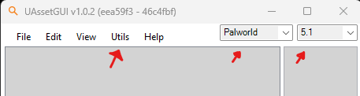

# Getting Started

Written by [Guillotine](https://next.nexusmods.com/profile/GuilloMods/mods) - All mods in the link are made using this technique. 

_Last updated: [26/12/24]_

**Difficulty:** *Beginner Friendly.*

In this guide I will teach you how to edit datatables, certain blueprints and other files using UAssetGUI instead of Unreal Engine. 

**Arguably** _easier than using Unreal, you won't have all the functionalities that Unreal has, but we can still do alot_ 

- **Note:** in order to make mods for the gamepass version, you will **need** to use Unreal Engine due to it being a different format. 

Programs you will **need** to follow along with this guide:
- For finding and exporting the game-files you want to edit - [FModel](https://fmodel.app/)
- For editing the files [UAssetGUI](https://github.com/atenfyr/UAssetGUI/releases)
- For turning your edited file into a mod file [UnrealPak](https://github.com/RiotOreO/unrealpak) - (Download link in the "About" section on the right)

Files you will **need** to follow along with this guide:
- Palworld's latest mapping file for the current version of the game, which can be downloaded from [here](https://github.com/PalworldModding/UsefulFiles/raw/refs/heads/master/Mappings.usmap).

## Getting setup.

First off, you will need to [install and setup FModel](https://pwmodding.wiki/docs/asset-swapping/StartingOut), follow the steps in the link and then meet me back here.

Now, let's make our first mod.

## Step 1. Exporting the file we want to edit

For the sake of starting out simple, let's change the crafting recipe of a pal sphere.

Open up FModel and let's find the file that holds the crafting recipe `datatable`. 

Double click on `Pal-Windows.pak`

**Most** of what we're interested in will be located in the folder path of `Pal>Content>Pal` and since we're looking for a `Datatable`, go into that folder.

Now you're greeted with alot of folders containing `Datatables` from the game, what we're looking for for this guide will be found in the `Item` folder.

Now, in this folder you will see a file called `DT_ItemRecipeDataTable_Common`, that sounds like what we're looking for but if you want to be sure, you can double click the file and read what is stored in it.

- **NOTE:** If the file you're intending to edit has a `_Common` variant, then that's the file you want to edit, editing the one **without** `_Common` does nothing.

Time to grab the file to edit it, to do this, you right click the file and `Export Raw Data (.uasset)`

Let's edit

## Step 2. Editing the crafting recipe of a pal sphere

First off, i want you to create a folder called "MyFirstMod_P" anywhere you want.

- **Note:** It's important that the folder name ends with `_P` for the game to be able to read your file over the official recipe datatable file.

Next, i want you to locate your `FModel Export Folder`.

Now, grab the `FIRST` folder, named "Pal" and drag it into your "MyFirstMod_P" folder

- **Note:** It's important that your mod `keeps the same folder structure` as the way it was exported, otherwise the game can't read it.

Time to open up UAssetGUI and set it up.

First, click `Utils` and `Import Mappings`, import the same `mappings` file you imported into FModel earlier.

Then, top right make sure it says `Palworld` and `5.1` (the Unreal version the game was made in)

Now you can go ahead and `File > Open` and locate your "MyFirstMod_P" folder and go through it until you find the `DT_ItemRecipeDataTable_Common.uasset`

We're in, click the + on `Export Data` > `Export 1` > `Table Info`. Now at the top you will see PalSphere, click it and now we can change the behaviour of the recipe itself.

Since we just want to edit the crafting recipe, let's decide on what we want the new cost to be. 

Let's make it cost 5 Ingots, 2 Red Berries and 3 High Quality Cloth. But first, you need to find the Item IDs, as the game calls the items differently than what's displayed in game.

For that, [you can click here](https://pwmodding.wiki/docs/game-data/item-table) and search for the item you need with `CTRL + F`

Now insert that data into the file, so for example `Material1_Id - CopperIngot` - `Material1_Count - 5` and so on.

After you've imported all the changes you want to make, `CTRL + S` to save or `File > Save`.

- **Note:** It's important that you save after every edit in one specific table, meaning you can't edit `Palsphere` and then `PalSphere_Mega` without saving in between as UAssetGUI will be confused on what you want to save and you might have to start over if you move on without saving.

Great, we have now edited the recipe and we can close UAssetGUI and move on to UnrealPak to turn our mod folder into a .pak file so it can be read by the game.

## Step 3. Finishing up the mod and turning it into a mod file

We're almost done, open up your UnrealPak folder that you downloaded earlier.

Simply drag your mod folder "MyFirstMod_P" over the `UnrealPak-Without-Compression` 

UnrealPak turned your mod folder into a .pak file and your mod is now complete.

Time to install it to our game and try it out, go to `steam/steamapps/common/palworld/pal/content/paks/Mods` (if you don't have a "Mods" folder, simply create it)

Insert your new file `MyFirstMod_P.pak` in the Mods folder and start up your game

If you see that the recipe for Pal Sphere changed, then congratulations, you have now made your first mod.

If nothing changed, you may want to look through the **"Note:"** comments i've left along the way as they're important for this all to work.

## Author Notes

Follow along to the next guide where we go a bit deeper into what we can do to add stuff that's currently not in the files. 

**Such as:** 
- Adding recipes
- Adding functionality to existing items
- Expanding the merchants sell offers

**and more**

*Feel free to message me on discord if you have any questions or run into any issues.*

**Good luck!** 

**Guillotine**