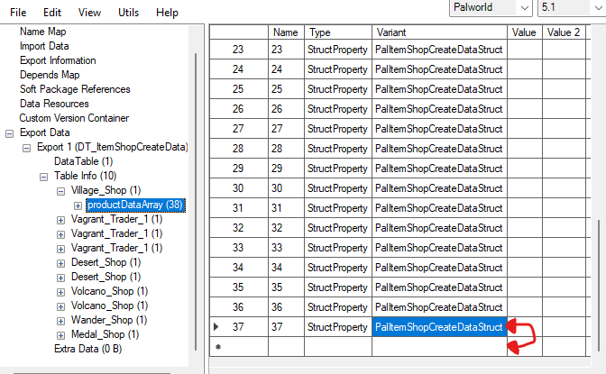
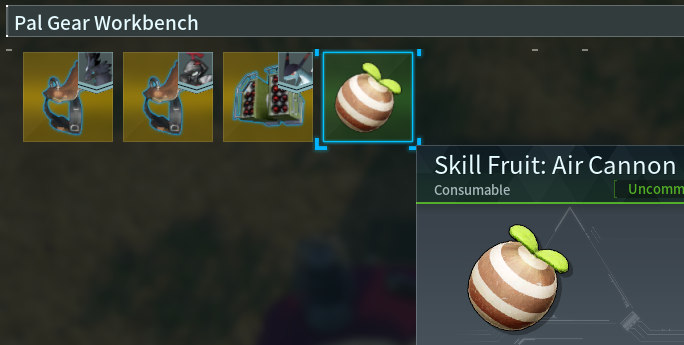

# Going Deeper

Written by [Guillotine](https://next.nexusmods.com/profile/GuilloMods/mods) - All mods in the link are made using this technique. 

_Last updated: [09/12/24]_

**Difficulty:** Intermediate

Welcome back, let's dive deeper and I will give you more ideas on what is possible.
In this section, I expect that you understand the concept and basics in the [first guide on UAssetGUI](./UAssetGuide1).
If you're ready, let's do this!

Programs you will **need** to follow along with this guide apart from the ones used in the first guide:
- For following along on the `Step 3. Add functionality to existing items` - [VSCode](https://code.visualstudio.com/) - Don't worry, we're not writing any code for this guide, I will just show you some tricks that we can use.

- Before heading into `Step 3. Add functionality to existing items` you need to follow the `install UE4SS to your game` , `Breakdown - Dumpers` part and also the `VSCode` section of `Add CXXHeaderDump to Workspace` found on [this page](https://pwmodding.wiki/docs/lua-modding/lua-modding-tools)

## Step 1. Add more sell offers to merchants

Let's start by showing you how you can add more items to the merchants, this will teach you the basics of the technique we will use for the future guides.

First I want you to export `DT_ItemShopCreateData`, either by going to `Pal>Content>Pal>Datatable>ItemShop` or at the top left, go `Packages>Search` and type what we want to find, in this case `ItemShopCreateData`.

Now open that file with UAssetGUI and go over to `Village_Shop / ProductDataArray` and scroll all the way down on the `right side`, you can see that we have 37 rows of "Variant" `PalItemShopCreateDataStruct` so let's add a new line here.

Click the `PalItemShopCreateDataStruct` ONCE and copy + paste it to the next row and change the number to 38, hit `save` and `re-open` the file to update it.

Now when you go back to `Village_Shop / ProductDataArray` and scroll down on the `left side` you can see that we now have a row called 38 that we can do whatever we want with so let's do something with it.

Let's add Dog Coins, the ItemID for it is `DogCoin` so enter that at the top row of `StaticItemId` instead of `PalItem_ToSell_05`

Now you have 5 different properties to play around with and I will explain them in short
- ProductType = This will be explained in the `Step 3. Add functionality to existing items` section, come back later.
- OverridePrice = The price you want the item to cost in the `Coin` currency
- BuyRate = Multiplier for the price of the item decided in `itemdatatable`, just leave it at 1 (you used to have to do math but they were nice and added OverridePrice, thanks Pocketpair)
- SellRate = the price the merchant will buy the item back for, just keep it at -1 for now
- Stock = How many of this item the merchant will have in stock, put this at 0 or higher else the item will not be visible in the shop.

Congratulations, you have now added a new item to the Small Settlement merchant, open up the game and see if it worked.

Save this mod folder for when you come back after reading `Step 3. Add functionality to existing items`

## Step 2. Add recipes

Now that you understand how to create new rows in a datatable, let's move onto adding new recipes and you will see how some files behave when trying to add new rows and how to combat it.

I want you to export `DT_ItemRecipeDataTable` again, if you still have the mod folder from the first guide page, you can use that if you want.

Now, I want you to open up `2 instances` of UAssetGUI and have them next to eachother, open the same Recipe file on both windows

Decide which window will be your `editing` window, i will use the left one.

Go to Table Info, scroll all the way down and copy the line HeadEquip023 onto row 591 to make a new line just like before, let's make a recipe for Air Cannon skill fruit, so name it Air Cannon or something similar, doesn't matter too much here. 

`Save & Re-Open` the file on the editor window

Now that you scroll down, you will notice that your new line "Air Cannon" has nothing in it, so go to your 2nd UAssetGUI window and open any item row, for example the PalSphere.

We now have to copy over the data from the PalSphere window over to our new Air Cannon window, so start copying each row `one by one` (I know it's a bit tedious but hey, it's for the greater good) **Make sure to save** after you've transferred all 18 lines over. (it starts at 0 so `total lines are 18`, don't be confused about it saying 17)

Now we just need to decide what our recipe will look like, so since we're making a recipe for Air Cannon we need the Item ID `SkillCard_AirCanon` and for the sake of the guide we will just leave the rest of the lines as they are

Congratulations, you've made a recipe, but wait.. There's no crafting table assigned to crafting skill fruits so we can't actually craft it anywhere.

Let's add that functionality to the Pal Gear Workbench in the next step.

## Step 3. Add functionality to existing items

This guide will start introducing you a bit to blueprint editing, which can be tricky at some parts and sometimes it just won't let us do what we want, but I will show you a little of what we can do.

**Note:** When working with blueprints, they will sometimes not allow us to open them and give us an error message, to combat this, I want you to export the whole `blueprint folder` as many files depend on the whole folder structure to be intact to allow us to even open the files, sometimes it will even tell us which file is missing and you can add that file to your `blueprint folder`. Store the folder wherever you want for future use.

Now that you have a blueprint folder that you can work with, go ahead and also export `BP_BuildObject_WorkBench_SkillUnlock` and store it in a `new mod` folder for now.

Now, open UAssetGUI again and go into your `Blueprints` folder and locate this same file in `Pal>Content>Pal>Blueprint>MapObject>BuildObject` (It's almost at the bottom)

Open `Export Data > Export 9 (ItemConverterParameter) > PalMapObjectItemConverterParameterComponent` This is the part where it can get tricky so bear with me.

- *If you didn't do the VSCode installation at the top of this page, now is the time to do it.*

Ok, let's do this, open up VSCode, right click `CXXHeaderDump` and then `Find In Folder`. Now I want you to search for `PalMapObjectItemConverterParameter` and click what comes up in the search `class PalMapObjectItemConverterParameter`

- *We're going to go a bit off track here quickly for the sake of explaining how we can implement extra functionality that didn't exist on the items previously.*

Here you see 7 different settings that we can choose to import to our `WorkBench_SkillUnlock` but if you noticed in UAssetGUI we `only have 3 of these settings` 
So let's start with importing `AutoWorkAmountBySec` so make a new line by copying `TargetRankMax` onto the next line, just like we've done in the previous steps. 

Now you also have to look at VSCode, next to `AutoWorkAmountBySec` we see it says `float`, that is important as we have to change the `type` on our new row from `IntProperty` to `FloatProperty` and now you can put any number value you want here, voila we now have an Automatic Pal Gear Workbench.

- *Ok, let's get back to what we were doing.*

Let's talk about the `ArrayProperty` of `TargetTypesA/B` for crafting stations, these decide what items can be crafted on any specific table so in UAssetGUI, click on `TargetTypesA` on the `left side` to start with. You can see that it has a value of `EPalItemTypeA::Essential` so let's go back to VSCode and make a new search for `EPalItemTypeA` to see what comes up in that Array.

Go to the first search result of `enum class EPalItemTypeA` and you will see alot of different options that we can add to our table. 

But to make it even easier on you, scroll down and you will see `enum class EPalItemTypeB` below our first search result. Here it's specified a bit better, Skills in this game are called `Waza` in the game files and if you saw the option of `ConsumeWazaMachine` then good job! Now we know our types are `Type A = Consume` and `Type B = ConsumeWazaMachine`

Let's go back and add a new row on Type A = `EPalItemTypeA::Consume` and for Type B = `EPalItemTypeB::ConsumeWazaMachine`

Congratulations, you can now craft skill fruits on the pal gear work bench, **but wait**, we were not working in our mod folder, we have been editing in the `Blueprint folder`, remember?

So let's open up 2 folder windows, one with our `mod folder` and one with the `blueprint folder`

Go all the way into your `mod folder` until you find the files of `BP_BuildObject_WorkBench_SkillUnlock`

Now locate the same files in the `blueprint folder` and `copy` all **4 files** and replace the **2** that are in your `mod folder` (edited files always come as 4 files)

- **Note:** The reason I say `copy` is because you maybe want to make further edits to your files and if they're no longer in the blueprint folder, you may not be able to open them without putting them back in the `blueprint folder` first.

Now you're ready to try your mod out so **.pak** up both your `recipe mod` and your `workbench mod` (make sure they end with _P) and install them to your game.

If all went well, you should be able to craft `Air Cannon Skill Fruit` on the Pal Gear Workbench now, good job!

- *As a last step, you may now `use your new knowledge` and try to figure out what you can do with the `Product Type` over at the merchants in Step 1.*

## Step 4. Combine your mod folders.

Before you upload your new mod, you may want to combine them so you don't upload `2 different mod files`

To do this, remember that the folder structure is very important for the mods to work.

What I do is `open 2 folder windows` and go folder by folder until I find the point where they split, so in this case we would find that at `Pal > Content > Pal` they split so we have one folder called `Blueprint` and one is called `DataTable` copy one or the other over and choose an appropriate name for your mod.

## Finishing Notes

**Important side-note:** Make sure you test your mods before uploading them so that you know your mod has the full intended functionality.

Congratulations, you've reached the end of the guide!

If you have any questions, feel free to message me and if you haven't yet, join our community over at the [modding discord](https://discord.gg/VJ3vAVztjZ) we're more than happy to help with whatever you need help with.

**Good luck** 

**Guillotine**