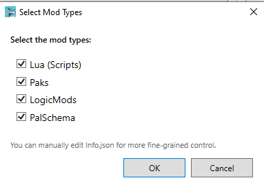
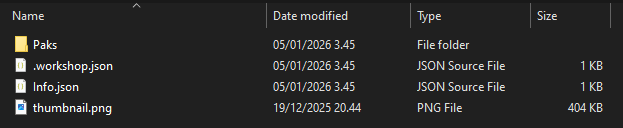
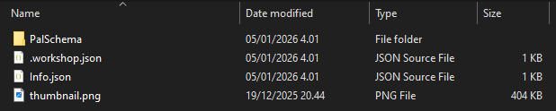
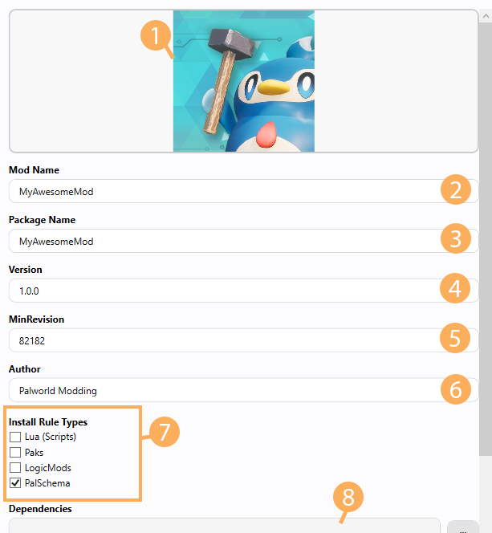

# Packaging

## Palworld Mod Uploader

Before we get started, we'll need to download `Palworld Mod Uploader` which should be available in your Steam Library if you own Palworld. Search for Palworld in your Library and you should be able to find it.


Once you have finished downloading the tool, launch it.


1. **Workshop Content Directory:** This is where your workshop items will be stored and by default it will be located in `C:\Program Files (x86)\Steam\steamapps\workshop\content\1623730`. If the path cannot be detected, you can manually set the path by clicking the `...` button between the path and Reload button. You might also have to manually create the `1623730` folder which is Palworld's Game ID.

2. **Reload:** This lets you refresh the contents inside the Workshop Content Directory, for example if you manually added a new folder in there while the Mod Uploader was open.

3. **Mod Information:** This is where you'll be able to fill in the metadata for your mod, we'll come back to this later in this guide.

4. **Create New Mod:** When you want to initialize a new mod, you want to start by pressing this button.

5. **Guide:** This is the official guide in the Palworld Mod Uploader repository on GitHub.

## Creating a Workshop Mod

Now that we have the basics out of the way, let's look into setting up a mod that we can upload to the workshop. This assumes you have a mod ready that you want to upload.

1. Click `Create a Mod` and a popup will appear asking you what type of mod you want it to be. You can select multiple, for example if your mod utilizes Lua+LogicMod you can select Lua and LogicMods or if it's a PalSchema mod that utilizes custom content from a Pak, you can select Paks+PalSchema.



If the mod creation succeeds, a new folder with numbers is created which is your workshop item's id and the folder will automatically open up in File Explorer. You should now have the following items in your new folder:

- `Info.json` which is the file that contains metadata about your mod like Mod Name, Author, Version, InstallRules and more.
- `thumbnail.png` which is the thumbnail for your mod on the workshop (File size must be under 1MB, otherwise you will get the error `k_EResultLimitExceeded` when trying to upload)
- A folder for the selected type (Scripts/, Paks/, LogicMods/, PalSchema/)
- `.workshop.json` contains tool metadata. Stores the Published ID and the last uploaded Version (You shouldn't modify this file yourself)

If you want to change the mod type afterwards, don't worry! You can change this in either the Mod Information section that was covered in the [Palworld Mod Uploader](#palworld-mod-uploader) section or you can edit the Info.json directly.

Do note that after you click `Create a Mod`, it will automatically publish it on the Steam Workshop with `Hidden` visibility meaning only you will be able to see it. You can skip this process by holding `Shift` when clicking the `Create a Mod` button which will only create it locally without uploading it to the workshop.

:::warning
When developing your mods, changes made in the workshop folder are currently not reflected in-game. You'll need to make your changes inside `Palworld/Mods/NativeMods/UE4SS/` (Lua/PalSchema/C++ Mods) or `Palworld/Pal/Content/Paks/` (LogicMods/Pak Mods) and then move those modified files into your workshop folder when you're done.
:::

## Packaging

Now we can get to the packaging process which is fairly simple. We'll split each mod type into its own section.

### Lua (Scripts)

Note that C++ mods are also supported under the same category (Lua).

When you create a Lua (Scripts) mod, you'll get a `Scripts` folder in which you will have a template `main.lua` file. Everything inside the `Scripts` folder will be packaged with your mod in case you have utility scripts that your mod requires. Lua mods are downloaded into `Palworld/Mods/NativeMods/UE4SS/Mods/YourModName`.

For C++ mods, you'll want to create a `dlls` folder and place your mod's dll file inside it and make sure it's called `main.dll`. You can delete the `Scripts` folder if it's purely a C++ mod.

You should not package an `enabled.txt` file, because Palworld's own Mod Manager will handle enabling/disabling the mod.


### Paks

When you create a Pak mod, you'll get a `Paks` folder in which you will place your `.pak` mods. When a user downloads your Pak mod, the `.pak` files will be downloaded into `Palworld/Pal/Content/Paks/~WorkshopMods/YourModName`.



### LogicMods

This is essentially the same as [Paks](#paks), except you'll have a `LogicMods` folder instead of a `Paks` folder. Download location will still be the same LogicMods location as before which is in `Palworld/Pal/Content/Paks/LogicMods`.


### PalSchema

When you create a PalSchema mod, you'll get a `PalSchema` folder in which you'll be putting folders such as `blueprints`, `raw`, `translations`, `items`, etc. directly.

PalSchema mods are downloaded to `Palworld/Mods/NativeMods/UE4SS/Mods/PalSchema/mods/YourModName`.




## Mod Information

Once you have packaged your mod files into their respective folders, you'll have to fill in the mod information before uploading it to the workshop.



1. Thumbnail of your mod which you can change by clicking on the image or by dragging another image into it. By default it is a picture of a Pengullet with a hammer. Make sure your thumbnail's file size is less than 1MB or you'll get the `k_EResultLimitExceeded` error when uploading your mod to the workshop.

2. **Mod Name:** This is the name it'll show on its workshop page after you've uploaded the mod. `MyAwesomeMod` by default.

3. **Package Name:** This will be the folder name of the mod when it is installed by users. Make sure it only contains alphanumerics and do not add spaces! `MyAwesomeMod` by default.

4. **Version:** Used to determine if there's an update available to the mod. Make sure to increment this each time you update something in your mod before uploading the changes. You don't need to increment this if you're just changing the thumbnail for example.

5. **MinRevision:** You don't need to touch this generally.

6. **Author:** This will be your Steam name by default, you shouldn't need to change it.

7. **Install Rule Types:** This is where you can change the type of your mod, for example if you had a PalSchema mod, but later you decide that you want it to also contain a `.pak` file, you would tick the `Paks` checkbox.

8. **Dependencies:** This is where you can setup dependencies for your mod based on the current mods you have created or downloaded like for example UE4SS. Currently this will not reflect properly on the workshop page, so you'll have to add the dependencies yourself on the workshop page again which will be covered in [Uploading](./uploading).

There are also Tags at the bottom which should be self-explanatory, they're used to search for mods that have those tags.

Once you're done making your changes, make sure to click `Save Info.json`.

## Dedicated Server Support

In case you want your mod to be supported on Dedicated Servers, you can do so by manually editing the `Info.json` and adding an extra `InstallRule` with `IsServer` set to `true`.

Example `Info.json`:
```json
{
  "ModName": "My Awesome Mod",
  "PackageName": "MyAwesomeMod",
  "Thumbnail": "thumbnail.png",
  "Version": "1.0.0",
  "MinRevision": 82182,
  "Author": "palworldmodding",
  "Dependencies": null,
  "Tags": [
    "Gameplay"
  ],
  "InstallRule": [
    {
      "Type": "Paks",
      "Targets": [
        "./Paks/"
      ]
    },
    {
      "Type": "Paks",
      "IsServer": true,
      "Targets": [
        "./Paks/"
      ]
    }
  ]
}
```

First install rule is for Palworld (Client) and the second rule is for PalServer (Dedicated Server).