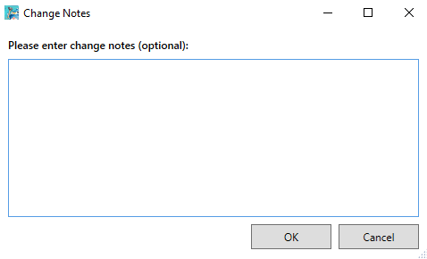

# Uploading

Now that you have everything done, you're ready to upload your changes to the Workshop! Note that when you click the `Create a Mod` button, it doesn't only create a mod folder for you, but it also uploads it to the Workshop with hidden visibility meaning only you can see the mod until you make it visible.

So basically when you click the `Upload To Steam` button, it updates the mod on the workshop so this button can also be used to push updates.

## Change Notes

Once you begin uploading your mod, it asks you to provide change notes which you can leave empty if you're uploading the mod for the first time. Typically it's a good idea to keep each change concise, for example:

```
- Added more skin variations for Chillet.
- Fixed Cattiva spinning in place when a custom skin is applied to it.
- Removed unnecessary double confirmation window when applying a skin.
```



Hit **OK** and the upload process should now start. Once the uploading has finished, it should open up the workshop page for your mod automatically.

## Workshop Page

You'll probably see something about your workshop item awaiting analysis. This is a process everyone goes through whenever you update anything in your mod, be it description or the actual files. This shouldn't typically take longer than a minute depending on the type of your mod.

Notice that the visibility is automatically set to Hidden by default for new workshop items. This allows you to test your mod locally before making it public for everyone to download!


You'll have access to a bunch of controls, most of which should be self-explanatory, but you'll probably care most about the `Add/Remove Required Items` and `Change Visibility`:

- **Add/Remove Required Items:** This is where you can setup dependencies for your mods like UE4SS for example. You might have to change this yourself manually on your workshop page since I've noticed that the `Dependencies` section in the Mod Uploader Tool doesn't seem to reflect the changes on your workshop page currently.

- **Change Visibility:** Once you're ready to go public, this is where you can make your mod available for everyone OR you can set it as friends only or even hidden/unlisted if you prefer to keep it private anyway.


## Final Notes (Important)

Make sure that you instruct users on how to enable mod support and specifically how to enable your mod since currently the mod support in Palworld is opt-in.

You should put the instructions in your description. Here's a template that you can reference:

```
[h1]Important[/h1]
After you subscribe to the mod, do these steps to enable the mod:

1. Launch the game and wait until you get to the title screen.
2. Go to Options > Mod Management and make sure [b]Enable Mod[/b] is set to [b]ON[/b].
3. Make sure the checkbox next to (MOD NAME HERE) is [b]CHECKED[/b]
4. Click the blue [b]Save[/b] button and the game will now restart.
5. Once the game starts up again, (MOD NAME HERE) should now be enabled.
```

The template utilizes formatting to make it look prettier, but you don't have to use formatting if you don't want to and you don't have to copy the template 1:1, it's just to give an idea. I still recommend leaving a notice of some kind for users, because otherwise you will get a lot of comments saying the mod doesn't work.

Basically put a short description of what your mod does as the first line and then after it, put the instructions and after that you can place whatever else.

**Now to explain why:** When someone hovers over your mod on the search page, it will show the first few lines of the description which should be the lines describing your mod. Having the instructions after that short description will make it easier for them to spot them when they first open up your workshop item's page.

That should be everything, now go upload some mods!

## Useful Resources

[Steam Text Formatting Guide](https://steamcommunity.com/comment/Recommendation/formattinghelp)

[Official Mod Uploader Guide](https://github.com/pocketpairjp/PalworldModUploader/tree/main/PalworldModUploader/docs/en)