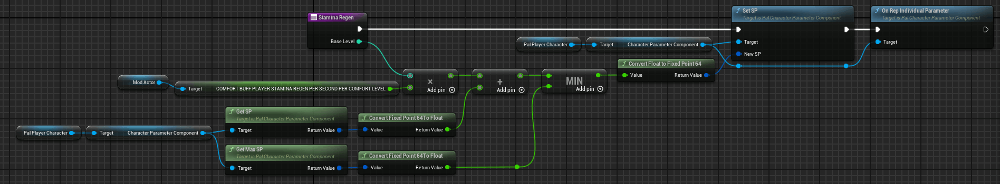

# Blueprint Examples

Example blueprint flows for common/desirable situations.

### Loading in a basic .json Configuration File

### How to Search for and Bind to Events
Not all fire or work like you think, just experiment. You can remove the Context Sensitive check to see all events you can bind to, but the list is huge.

### Detecting and Binding to Player Entering/Leaving Base Camp

### Getting Player's Guild Object and Guild Level

### Getting Some Default Game or Player Settings

### Modifying a Player's HP/Stamina/Shield and Replicating for Server Play

