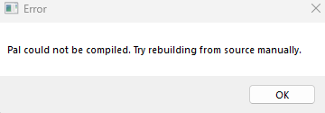
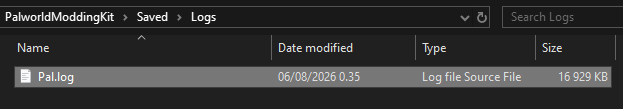

# Troubleshooting

If you're running into any problems with the modding kit, this guide will walk you through on how to diagnose the problem.

## Finding the Log file

You can find the log file in this location `PalworldModdingKit/Saved/Logs` and it will be named `Pal.log`.

If you got the "Pal could not be compiled" error, open this file and we'll go through some common errors.

## Common Errors

You can ignore the first ten lines in `Pal.log` about `Failed to load` and `File does not exist` as those don't affect if the modding kit will compile or not.

Below is a list of errors that you can easily `Ctrl+F` in the `Pal.log` file.

### The following output paths are longer than 260 characters
This happens when Unreal Engine or Palworld Modding Kit is installed in a location where the path is too long. Move it closer to the drive, for example something like `C:/PalworldModdingKit` or `C:/Unreal/UE_5.1`.

### This file should be updated so SN-DBS can support this version
This happens when you download the wrong SDK files for WWise.

### Unable to find valid 14.38.33130 toolchain for VisualStudio2022 x64
You most likely forgot to install `MSVC v143 - VS 2022 C++ x64/x86 Build Tools (v14.38-17.8)`. Make sure you didn't accidentally install the ARM version instead.

### Detected compiler newer than Visual Studio 2022
You forgot to install `MSVC v143 - VS 2022 C++ x64/x86 Build Tools (v14.38-17.8)` or you didn't do the [Changing build tools from VS 2019 to VS 2022](./installation#changing-build-tools-from-vs-2019-to-vs-2022) step mentioned in the Installation section.

### Install a version of .NET Framework SDK at 4.6.0 or higher.
You forgot to install [.NET 6](./prerequisites#net-6)

### You must install or update .NET to run this application
You forgot to install [.NET 6](./prerequisites#net-6)

### Windows SDK must be installed in order to build this target
You forgot to install required components during [Visual Studio 2022](./prerequisites#visual-studio-2022) installation. You should have Visual Studio Installer on your computer if you've already installed Visual Studio and this will let you modify your existing 2022 installation.

### A conflicting instance of UnrealBuildTool is already running
This happens if you try to open another `Pal.uproject` while it's still trying to compile.

## Other things to note

- If your WWise x64_vc170 folders have the names UWP in it, it's because you selected the wrong version of WWise in the drop downs and you selected Universal Windows Platform instead of Windows. This will cause your build to fail.