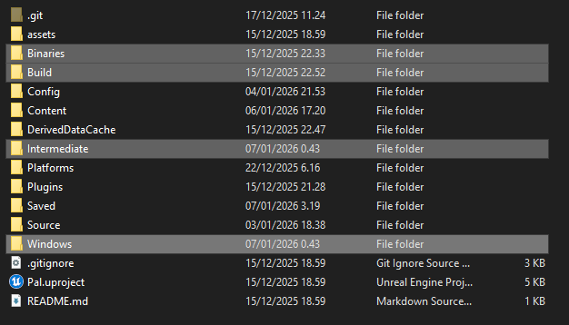

# Updating

This section will walk you through updating your Palworld Modding Kit to the latest version.

## Downloading the Latest Version

### Using Git

If you cloned the [Palworld Modding Kit](https://github.com/localcc/PalworldModdingKit) repository using Git, you can easily update your local copy by running the following commands in your terminal while inside the PalworldModdingKit folder:

```bash
git fetch
git pull
```

This will fetch the latest changes from the repository and merge them into your local copy.

### Using ZIP Download

If you downloaded the Modding Kit as a ZIP file, you'll need to download the latest version from [here](https://github.com/localcc/PalworldModdingKit/archive/HEAD.zip).

1. In your local Modding Kit folder, delete the `Source` folder and replace it with the `Source` folder from the newly downloaded ZIP file.

2. Replace the `Config`, `Plugins` folders and `Pal.uproject` with the ones in the ZIP file. You can also delete these folders/files before replacing them, but make sure to back up your `WWise` folder in the `Plugins` folder before doing this so you don't have to redo the process of setting up `WWise` again.

## Forcing a Rebuild

Now that you have the latest files, you will need to force a rebuild of the Modding Kit to ensure all changes are applied correctly. You can do this by deleting the `Binaries`, `Build`, `Intermediate` and `Windows` folders in your Modding Kit directory as seen in the image below.



After deleting these folders, open the `Pal.uproject` file by double-clicking it. If it tells you that modules are out of date and need to be recompiled, press **YES**. This will take a while so be patient.

Once it's done compiling, it should open Unreal Editor and you're good to go!