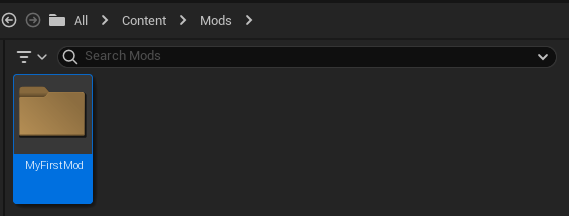
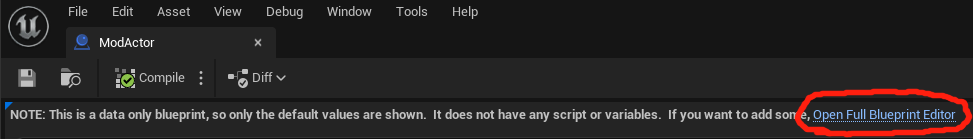
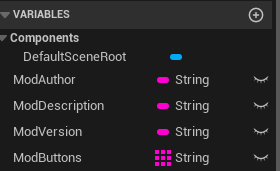
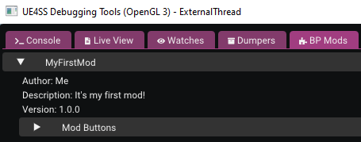
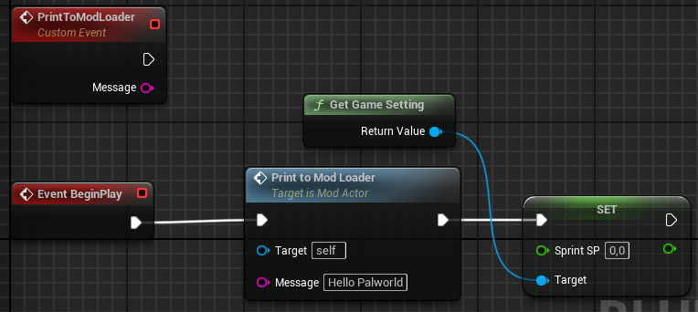
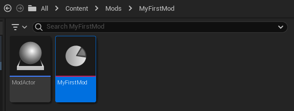
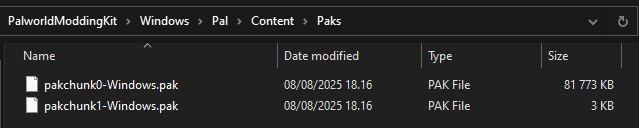

# Introduction

So what are Logic Mods? It's a modding system originally invented for Unreal Mod Loader (UML), where the mod loader would look for any .pak mods in `Paks/LogicMods` directory, assuming the following conditions were met:

1. The .pak file name must match the mod folder name you had in Unreal Editor before packaging the mod.
2. The .pak mod needed to contain a `ModActor` asset.

Development for UML eventually ceased and UE4SS became the new popular tool for modding Unreal Engine games and UE4SS adopted the Logic Mods system from Unreal Mod Loader (with permission of course).

You might've seen some .pak mods that end with a `_P`. These are not the same thing as Logic Mods and are referred to as patch paks which you can read more about in this [article](https://buckminsterfullerene02.github.io/dev-guide/Basis/PakPatching.html).

If you're creating Logic Mods for UE4SS, never include `_P` at the end. The `_P` suffix should be reserved for patch paks only. The reason for this is that they're both installed in different folders and will make troubleshooting mod issues very difficult later due to not knowing what's actually a Logic Mod and which is a patch pak.

## Requirements

- **Basic Understanding of Unreal Editor** - This is important, because otherwise you will be very confused. This knowledge is valuable and extends to any Unreal Engine game. Just because you're modding doesn't mean it's not relevant. There are a ton of free videos available on YouTube for getting started with using Unreal Editor.

- [**Palworld Modding Kit**](../../palworld-modding-kit/prerequisites)

- [**UE4SS**](../../../users/ue4ss/downloading.md)

## Setup

1. Assuming you've finished setting up your Palworld Modding Kit (PMK), open up the `Pal.uproject`. Once the Editor is open, you should see something like the image below.

2. In the `Content Browser`, create a new folder called `Mods` in which all of our Logic Mods will go.

3. Navigate inside the `Mods` folder and create another folder called `MyFirstMod`. This will be our mod that we'll be working on. You can also opt to use a name other than `MyFirstMod`.

4. Next, we want to create a new `Blueprint Class` with a Parent Class of `Actor`, which we'll call `ModActor`. This makes UE4SS see our mod as a LogicMod.

5. Open the `ModActor` we just created and navigate to the `Event Graph` tab.

:::info
If you don't see an `Event Graph` tab and instead you see the text "NOTE: This is a data only blueprint, so only the default values are shown...", Click on the blue `Open Full Blueprint Editor` text at the end.

:::

## UE4SS Events

Before we continue, we'll look into a variety of different events that UE4SS provides for our Logic Mods. To use these, simply create a new custom event in your Event Graph. Below is a list of all UE4SS events.

### PrintToModLoader

`PrintToModLoader` is useful for printing various messages to the UE4SS Console window which you can enable in the `UE4SS-Settings.ini` file by setting `ConsoleEnabled = 1` under `[Debug]` section.

To use `PrintToModLoader`, add a new Custom Event in your Event Graph and call it `PrintToModLoader` with a String parameter called `Message`.

### PreBeginPlay

`PreBeginPlay` is called when the ModActor is spawned. You'll typically never want to use this since it's called way too early for you to be able to make use of it.

### PostBeginPlay

`PostBeginPlay` is called when the PlayerController's BeginPlay is called. You're generally better off just using the standard `BeginPlay`.

### ModMenuButtonPressed

`ModMenuButtonPressed` is used to read button presses from UE4SS GUI Console's `BP Mods` tab, assuming you added any buttons to your mod via the `ModButtons` variable in your `ModActor`. Mod Buttons will be its own tutorial, since there's a lot to it.

## ModActor Variables

`ModAuthor`, `ModDescription` and `ModVersion` are all String variables and they're used to display information about your mod in the `BP Mods` tab of the GUI Console.

`ModButtons` is an Array of Strings which can be used to create buttons that interact with your mod in the `BP Mods` tab.

Generally `ModButtons` is not used at all and it is preferred to use Widgets or something else to create an in-game interface since the end user shouldn't be enabling UE4SS GUI Console due to loss of performance.

I think this pretty much covers all of the utilities provided by UE4SS. We can now return back to where we were!

## Implementing Logic

We now have a ModActor, but it's a little empty. Let's add some functionality to our mod.

1. If you still have `Event Graph` open for your `ModActor`, create a `PrintToModLoader` event.

2. Under the Graphs category, you should see your `PrintToModLoader` event, drag it to our Event Graph and connect `BeginPlay` to it. You can set Message to whatever you want. Now when the `ModActor` spawns in, it'll print whatever message you chose to the UE4SS Console.

3. Of course, printing just a message would be boring, so let's do something more interesting. Right-click anywhere on the Graph and in the Search Box, type `Get Game Setting` and click on the Highlighted entry. You now have a reference to the Game Setting object which contains many gameplay altering variables.

4. Inside the `Get Game Setting` block, you'll see an empty blue socket. Hover over it and start dragging from it and release anywhere on an empty spot on the Graph. A context menu will open.

5. Scroll to the bottom where it says `Variables`. Expand it and it'll reveal another category called `Pal Game Setting`. Expand that as well and now you have a bunch of game variables you can experiment with.

6. In the Search Box, type `Set Sprint SP` and click on it. `Sprint SP` is the rate at which the player's stamina is used when sprinting. Having it at 0.0 for example would make it so that you can sprint infinitely.

7. You should now have a `Set Sprint SP` node on your Event Graph. Connect it to our `PrintToModLoader` node and your Event Graph should look like the image below.

We're done, now all that's left is to package our mod and install it.

## Packaging

1. Inside our `MyFirstMod` folder, we'll want to create a `PrimaryAssetLabel` asset, which you can find in `Miscellaneous > Data Asset` which will open another window where you can search for `PrimaryAssetLabel`. Once you find it, select it and name it whatever you want. For this tutorial, we'll call it `MyFirstMod`.

2. Open the `PrimaryAssetLabel` we just created and make sure you have the following values in it:

- Chunk ID: 1
- Cook Rule: Always Cook
- Label Assets in My Directory: Checked

For this tutorial, we'll assume this is our only mod, but if you create more mods in the future, make sure the Chunk ID is unique for each mod you create and make sure you never set it to 0 as this is reserved for the game itself.

Example: MyFirstMod is assigned to Chunk ID of 1, you create another mod called MySecondMod, you'd want to assign a Chunk ID of 2 to it. Otherwise the two mods get combined and you may get weird effects if you're running both mods in your game.

3. Save the `PrimaryAssetLabel` and close the Asset window.

4. Now all that's left is to package our project which you can do by going over to the `Platforms` button and then navigating through `Windows > Package Project`. A window will open in which you can just hit `Select Folder` and it'll begin the packaging process. This might take a while if it's your first time.

5. After the Editor has finished packaging, you'll want to open the root of your Palworld Modding Kit folder outside the Unreal Editor and navigate through `Windows > Pal > Content > Paks` and you should see `pakchunk0-Windows.pak` and `pakchunk1-Windows.pak`.

`pakchunk0-Windows.pak` is the game's own content and anything above 0 is our custom mods. In this case, we're looking for `pakchunk1-Windows.pak`.

6. Copy `pakchunk1-Windows.pak` and let's navigate to Palworld's root directory. I'll teach you a trick for finding it quickly if you're not sure how to get there.

7. Open up Steam and go to your Library. You'll want to right-click on Palworld and then select `Properties`. In the window that just opened, go to the `Installed Files` tab and click on the `Browse...` button. This will immediately take you to Palworld's root directory.

8. Next, navigate to `Pal > Content > Paks` and create a `LogicMods` folder if you don't already have one.

9. If you still have `pakchunk1-Windows.pak` copied in your clipboard, paste it inside the `LogicMods` folder we just created.

10. If you remember, we called our mod's folder `MyFirstMod` in the Editor. You'll want to make sure you rename the file from `pakchunk1-Windows.pak` to `MyFirstMod.pak` or otherwise UE4SS will error out and print something like `Class for ModActor was invalid`.

That's it! Load up a save, try running around and you should be able to sprint infinitely. If you have console enabled, you should be able to see your chosen message printed by `PrintToModLoader`. It'll also show up in `UE4SS.log`.