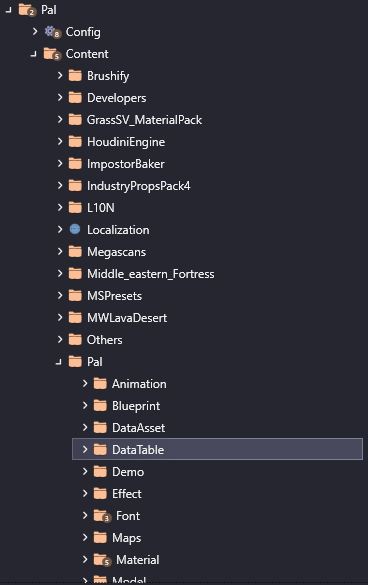

# Modding Tools
If you already know the tools, you can skip ahead, but don't blame us if we reference something and you don't know what we're talking about.

## **[UE4SS](https://github.com/UE4SS-RE/RE-UE4SS)**
---
This is your bread and butter. UE4SS is a scripting service for unreal engine which allows us to even load the mods at all. It also comes with a console that is extremely helpful for developing and testing mods.
### **Installation**
---
:::note
If you're using a mod manager, you probably have UE4SS installed already, but just in case, we'll cover it here. You should still check your `UE4SS-settings.ini` to ensure they match the values provided
:::
- Grab the latest [zDev Version](https://github.com/UE4SS-RE/RE-UE4SS/releases) from the releases tab
- Extract `Mods`, `dwmapi.dll`, `UE4SS.dll` and `UE4SS-settings.ini` into your `Palworld/Pal/Binaries/Win64` folder
- Open `UE4SS-settings.ini` in your editor of choice, make sure you have the following settings:
    - `ConsoleEnabled = 0`
    - `GuiConsoleEnabled = 1`
    - `GuiConsoleVisible = 1`
    - `EnableHotReloadSystem = 1` to enable reloading with `Ctrl + R`

:::warning
If you get a white console screen when UE4SS loads, change `GraphicsAPI` to `dx11`
:::

### **Breakdown**
---
UE4SS has 5 tabs, and you will make heavy use of two of them. 

**Console** - This is the first heavily used tab, and it's self-explanatory. This is where everything you `print()` will show up. Not much else to say.

**Live View** - This lets you get a live view of stuff in memory, filtered by whatever you search. It is incredibly useful and will probably be your most used tool. I'll cover its use in more detail once we get further into things.

**Watches** - If there's a value you want to keep an eye on from Live View, you can `right-click` -> `Watch` to get it stickied in this tab. Honestly I don't use it much, but it can be useful when testing stuff if you want to keep an eye on specific values.

**Dumpers** - Important for the first use, untouched afterwards for the most part. Right now, before you do anything else, you should `Dump CXX Headers` and `Generate Lua Types`. 
- `Dump CXX Headers` gives you a `CXXHeaderDump` folder with all of the header files to dig through. It's more or less the same as the stuff in `PalModdingKit/Source/Pal/Public`, but a slightly different format. Use whichever you prefer. What's the difference? The `PalModdingKit` folder has all the difference classes broken down into their own files. If you like your stuff separted all nice and neat, then use that. You grab the file for the class you want and everything relevant is in there. If you're a barbarian like me and prefer working with only one file, you can use the `CXXHeaderDump`, where pretty much everything we care about is stuffed into one file, `Pal.hpp`. They also have slightly different formatting. Up to you.

- `Generate Lua Types` will create a `types` folder in your `Mods/shared/` folder, which helps give intellisense autocomplete as long as you open `Mods` as your project folder. You can also search through these types rather than the `CXX Headers` or `PalModdingKit`, if you prefer the Lua layout. It's similar to `CXX Headers` in that most things are in `Pal.lua`, but they're written in Lua syntax rather than C++

**BP Mods** - Something to do with BP stuff...idk man I'm a Lua monkey 💀

## **[FModel](https://fmodel.app/)**
---
Follow the installation section on the [FModel](/docs/developers/useful-tools/fmodel) page. 

For us on the Lua side, this is mostly used to view the data table values in the game. Yes, you _can_ look through BPs, but I think it's much easier to search through the header files. `uasset` files can be awkward to browse through.

For data tables, I recommend just saving them all as JSON so that you can just do `Find in Files` with VSCode. 

To do that:
- Open `Pal/Content/Pal` folder in FModel
- Right-Click `DataTable` 
- Click `Save Folder's Packages Properties (.json)`

    

         
    

    

        
    

Then when you want to search through them, just search through the root `DataTable` folder. 

## [VSCode](https://code.visualstudio.com/download)
---
Or your editor of choice. I prefer VSCode with the Lua extension. Since that's what I have installed, that's what I'll base the tutorial off of. If you chose something else, you'll have to convert these instructions to the relevant stuff in your editor.

Don't make me explain how to install it or I cry.

### Modding Setup

- Once installed open up a new window, then `File` -> `Add Folder to Workspace` 
- Navigate to your `Binaries\Win64` folder and add both `Mods` and the `CXXHeaderDump` folder you generated earlier
- You'll also want to add the `DataTable` folder you just dumped from FModel
- You can then save that workspace as whatever you want. Should look something like the picture below.

All of your dev stuff will be in `Mods/YOUR_MOD_FOLDER` and you'll use `CXXHeaderDump` to search through the header files, and the `DataTable` folder if you want to search through those. 

:::note
We use `Mods` as the root folder for our mod because the library info for UE4SS and the generated lua types are in `Mods/shared`. Otherwise you have to copy that into every single one of your mods to get the intellisense.
:::