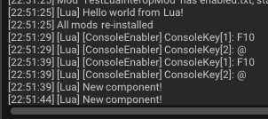
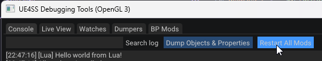
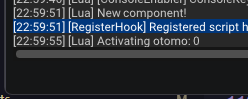
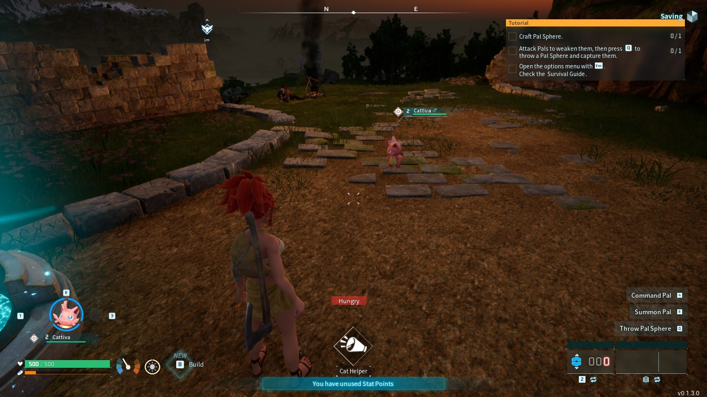

# Intro to Hooking Functions

In this tutorial, we will be hooking the function responsible for summoning a pal from your party.

## Hooking functions 

To hook a function in ue4ss, we use the `RegisterHook` function as discussed in the previous tutorial.

The signature of the function looks like so:

```
RegisterHook(FunctionName, Callback)
```

The parameters are as follows:

* `FunctionName` - is the function name we could get from ue4ss LiveView
* `Callback` - is the lua function we want to get called, when the hooked function finishes executing. This function can accept several parameters, which will be discussed later.

:::note
UE4SS hooks execute after the hooked function has finished executing. We have the ability to inspect the return value, and override it.
:::

Replacing a hook's return value is as simple as just using `return` with the new return value. If you don't wanna touch it, you can just not use this directive in your hook.

## Registering for object creation

However, for the `RegisterHook` function to work, our object needs to already exist, so here's where another important function comes in: `NotifyOnNewObject`.

This function will allow us to execute some code, when an object with a specified class gets created, the signature of the function is as follows:

```
NotifyOnNewObject(ObjectPath, Callback)
```

With the parameters being:

* `ObjectPath` - the path to the object we wanna watch for creation, we could get this from ue4ss LiveView.
* `Callback` - the function we want to get called, when the given obejct gets created. This function accepts a single parameter which is the instance of the created object.

## Writing our first hook

So for this simple example, we would want to write a snippet of code, which would scale down pals that we spawn from our party.

First of all, all our pals that are part of our party are called `otomo` in this game, so we would like to find something related to that. 

Aha! There's a `BP_OtomoPalHolderComponent`, which is responsible for storing your party pals, and spawning them when requested to.

After looking throgh it's functions, we can find one with a signature like this:

```cpp
void ActivateOtomo(int32 SlotID, FTransform StartTransform, bool& IsSuccess);
```

This is the function that is responsible when a pal from our party gets spawned (e.g. throwing it from our party).

### Subscribing to component creation

Let's hook that function! But first, we need to make sure the object we want to hook it on exists, so let's do the hooking whenever a new object spawns. And for that we will need to use `NotifyOnNewObject`.

So let's do something already!

```lua title="main.lua"
print("Hello world from Lua!")

RegisterHook("/Script/Engine.PlayerController:ClientRestart", function (Context)
    NotifyOnNewObject("/Game/Pal/Blueprint/Component/OtomoHolder/BP_OtomoPalHolderComponent.BP_OtomoPalHolderComponent_C", function (Component)
        print("New component!")
    end)
end)
```

This should print `Hello world from Lua!` when we launch our game, and when we enter the world, we should see our message appear. So let's open the game and try it!

:::warning
If you're not seeing any messages from your mod appear, make sure you have `enabled.txt` in your mod folder.

If there are still no messages, edit `mods.txt` to include your mod and enable it there.
:::


And now let's see the logs..



Yay, it works!


:::note
We register a hook for `ClientRestart` before trying to register for `NotifyOnNewObject`, because otherwise registration is not reliable and might not always get fired when the component gets created.
:::


### Hooking the function

Now it's time to write the hook we want, for now let's just print that our pal got activated. To do this, change your code to the following:

```lua title="main.lua"
print("Hello world from Lua!")

RegisterHook("/Script/Engine.PlayerController:ClientRestart", function (Context)
    NotifyOnNewObject("/Game/Pal/Blueprint/Component/OtomoHolder/BP_OtomoPalHolderComponent.BP_OtomoPalHolderComponent_C", function (Component)
        print("New component!")
        RegisterHook("/Game/Pal/Blueprint/Component/OtomoHolder/BP_OtomoPalHolderComponent.BP_OtomoPalHolderComponent_C:ActivateOtomo", function (self, SlotId)
            print("Activating otomo: " .. SlotId:get())
        end)
    end)
end)
```

After doing so, you can press the `Restart All Mods` button in ue4ss.




After reloading your mods, return to the title screen, and enter your world again. Now try throwing a pal from your party, and you should see this in your console:





Nice! We can now get notified when someone spawns a pal from their party. Now let's do something useful with it. For the purposes of this tutorial, let's make the pal slightly smaller. 

For that we would require to get an instance of the pal's actor, but how can we do that? We only get the SlotID afterall.

Because the component we have actually inherits from `UPalOtomoHolderComponentBase`, we can look into the palworld modding kit headers, for other functions it has, we can see an interesting function:

```cpp
UFUNCTION(BlueprintCallable, BlueprintPure)
APalCharacter* TryGetOtomoActorBySlotIndex(const int32 SlotIndex) const;
```

This accepts a slot index, and gives is a pal actor, exactly what we need! So let's use that:

```lua title="main.lua"
print("Hello world from Lua!")

RegisterHook("/Script/Engine.PlayerController:ClientRestart", function (Context)
    NotifyOnNewObject("/Game/Pal/Blueprint/Component/OtomoHolder/BP_OtomoPalHolderComponent.BP_OtomoPalHolderComponent_C", function (Component)
        print("New component!")
        RegisterHook("/Game/Pal/Blueprint/Component/OtomoHolder/BP_OtomoPalHolderComponent.BP_OtomoPalHolderComponent_C:ActivateOtomo", function (self, SlotId)
            print("Activating otomo: " .. SlotId:get())

            local HolderComponent = self:get()
            local OtomoActor = HolderComponent:TryGetOtomoActorBySlotIndex(SlotId:get())

            OtomoActor:SetActorScale3D({X = 0.6, Y = 0.6, Z = 0.6})
        end)
    end)
end)
```

:::note
Q: Why do we call `:get()` sometimes?

A: Some parameters we get inside of our hooks are actually `RemoteUnrealParam`, usually those are instances of actors, objects, etc. So for us to get the inner value of them we need to call `:get()`
:::


So this code gets the component instance, gets a pal actor by the currently active slot index, and sets it's 3D actor scale to 60% of the original one. Let's hop into the game and check that!


