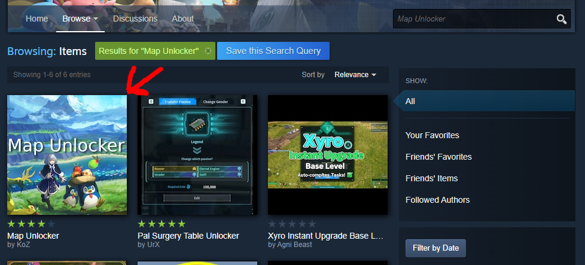
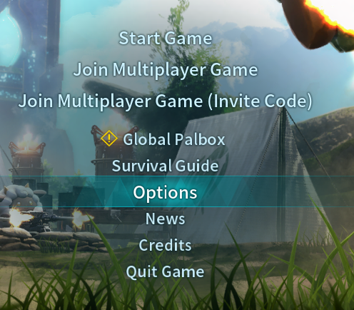
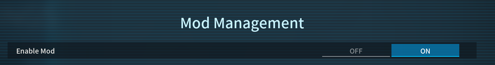

# Installing Mods

Let's start by looking for some mods. You have two ways to get to the Palworld's Workshop page which is either by navigating from the Steam client or from within Palworld itself. We'll just use the Steam client for now.

## Navigating to the Workshop Page

1. Start by opening your Steam
2. Navigate to your **Library**
3. Click on **Palworld**
4. Click **Workshop** on the right side

You should now see Palworld's Workshop page. By default it will show the most popular mods, but you can check all of them by clicking **Browse** and then 
**Items**.

## Downloading Mods

We now want to pick a mod to download, we can try out **Map Unlocker** for example. Let's search for **Map Unlocker**.

Open the page for **Map Unlocker** and you should see the following on the right side of the screen "**REQUIRED ITEMS**". This means that the mod has a dependency which is UE4SS in this case.

If you're wondering about what UE4SS is supposed to be, in simple terms it provides a modding API which enables creation of more advanced mods. You can read more on UE4SS here: https://docs.ue4ss.com/index.html

Note that **Subscribe** on workshop is equivalent to **Download**. When you subscribe to a mod, it will be downloaded for your game.

When you subscribe to a workshop item that has a dependency, Steam will automatically give you a popup asking if you want to download the dependency as well in case it's missing.

You can just click on **Subscribe to All** and it'll download everything that's required, including the mod itself. If you skip on the dependencies, the mod will most likely not work!

Once you've clicked **Subscribe to All**, you should now see two downloads starting which is UE4SS and MapUnlocker. After the download is complete, we can now start Palworld, but before we can actually use the mods, there's something we still need to do in-game.

## Enabling Mod Support

We'll first need to enable mod support within the Options so let's navigate there. Go to Options > Mod Management and turn "**Enable Mod**" On.

 

The mod list should no longer be greyed out and you can now start enabling your mods.

You should see a checkbox next to each mod which means:
- **Checked**: Mod is enabled  
- **Unchecked**: Mod is disabled

Let's make sure everything is checked.

After you have enabled the mods, click on **Save** and the game will restart and load your mods.

Create a new world and let's see if we were successful. If we did it right, your map should be fully unlocked without any fog!

:::tip
If you need to remove a mod, but you can't access the menu in-game due to crashing for example, you can also **Unsubscribe** from the mod in Workshop and it'll remove the mod once you launch the game!
:::

That's all there is to modding Palworld through workshop, it's simpler than ever. However you might run into some issues and those will be covered in the [Troubleshooting](./troubleshooting) section.