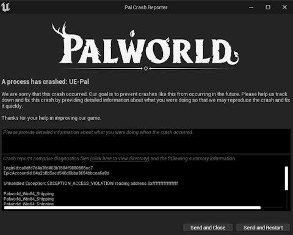
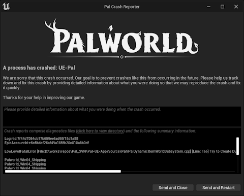

# Troubleshooting

If your game is crashing, mods are not working or you're having other issues after installing mods, this article will cover most of it.

## Crashing at Startup

Seeing the Crash Reporter after launching the game can occur for many reasons and here's a little checklist you can use to determine the cause and how to fix it.

- Did you install UE4SS from Workshop, but you also had UE4SS installed from an external source before the Workshop update? If this is the case, make sure that you delete dwmapi.dll from the Win64 folder or rename it to something else, because you will otherwise have two copies of UE4SS running which will cause a crash.

- Do you potentially have a mod that could be outdated? You will typically see something about corrupt data being found which is a good indicator of this being the case. This is common after a major update to Palworld and you'll have to unsubscribe from the problematic mod until it is updated. To determine which mod is causing it, you'll have to keep unsubscribing from your mods one by one until the game starts up again.

## Crashing when loading a World

This is where you should investiage your error message that the Crash Reporter is showing you.

I'll do separate sections here to make it easier to understand.

### Missing Items

You most likely used a mod that adds custom items, the game got an update and maybe that mod got outdated which means the mod isn't loading anymore.

This will result in the world panicking when it's trying to load items that don't exist in the game anymore. Applies to developer items that used to exist in the base game.

It will typically mention something about either PalDynamicItemWorldSubsystem or StaticItemId.

See [Fixing a Corrupted Save](#fixing-a-corrupted-save).

### Outdated Mods

This can happen due to game updates making mods outdated where they are calling invalid code during world load which results in a crash. Disable mods one by one until you figure out which mod is causing it. If the error message has a mention of UE4SS then it is caused by a mod that depends on UE4SS.

## Infinite Loading During World Load

If you're stuck in an infinite loading screen after selecting a world, you might've installed a mod that adds custom buildings at one point in your playthrough and now that mod is either uninstalled or outdated which causes the game to infinitely look for data regarding the missing building(s). See [Fixing a Corrupted Save](#fixing-a-corrupted-save).

## Fixing a Corrupted Save

You can use [PalworldSaveTools](https://github.com/deafdudecomputers/PalworldSaveTools) to fix a corrupted save without having to reset your progress.