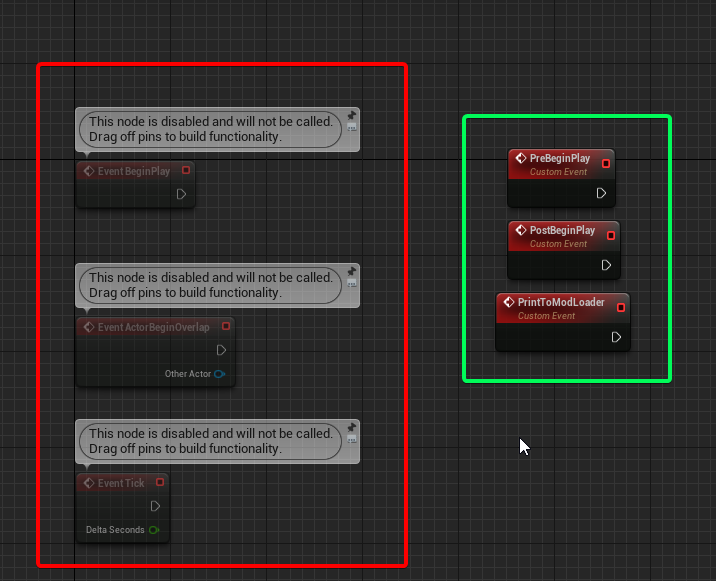

# Erstellung einer simplen Mod

Wo wir grade aufgehört haben sollte `Pal.uproject` doppel klicken sein. Dieser Bildschirm sollte sichtbar sein

import { FaFile, FaFolder } from "react-icons/fa";
import { MdEvent, MdOutlineEventAvailable, MdOutlineEventBusy, MdInstallDesktop   } from "react-icons/md";

## <MdInstallDesktop/> ModActor Einrichten

1) Sollte in deinem `Content Browser` kein Ordner ( <FaFolder/> ) mit dem Namen `Content` sein erstelle ihn.
2) In `Content` erstelle einen Ordner ( <FaFolder/> ) mit dem Namen `Mods`. Hier werden alle Mods die wir erstellen sein.
3) Deine Ordnerstruktur sollte wie folgt aussehen. (***Ignoriere dabzQOL und dabzReflex***) 
4) Erstelle einen Ordner ( <FaFolder/> ) in `Mods` mit dem selben Namen den deine pak Datei später haben soll. (In diesem Fall nutze Ich _*dabzReflex*_)
5) In diesem Ordner ( <FaFolder/> ) werden wir eine neue `Blueprint Class` die ein `Actor` ist erstellen. Sie muss den Namen **_ModActor_** tragen 
6) Nun sollte dein `Content Browser` wie folgt aussehen, als nächstes doppel-klicke deinen `ModActor` und stelle sicher das du im `Event Graph` tab bist 
7) Jetzt ist der ModActor technisch eingerichtet, aber es gibt noch einige weitere Informationen, die im Folgenden zu finden sind.

## <MdEvent/> ModActor Events

import Tabs from '@theme/Tabs';
import TabItem from '@theme/TabItem';

<Tabs>
    <TabItem value="usedevents" label="Used Events" attributes={{className: 'usedevents'}} default>
        - ***PreBeginPlay*** - Dieses Ereignis ist zu früh, um es für die Initialisierung der Mods zu verwenden. ***(Funktioniert nur in ModActor)***
        - ***PostBeginPlay*** - Dieses Ereignis wird ausgelöst, wenn der Player Controller Begin Play aufgerufen wird ***(Funktioniert nur in ModActor)***
            - Das empfohlene Ereignis für die Initialisierung der meisten Dinge in Ihrer Mod.
        - ***Event Tick*** - Dieses Ereignis wird bei jedem einzelnen Tick ausgelöst.
            - Dies wird üblicherweise verwendet, wenn ein Ereignis benötigt wird, das bei jedem einzelnen Tick aktualisiert wird.
        - ***PrintToModLoader*** - Erlaubt es über einen Blueprint in die UE4SS-Konsole auszugeben. ***(Funktioniert nur in ModActor)***
            - Um dieses Ereignis zu verwenden, erstelle im `ModActor` ein `Custom Event` mit dem genauen Namen `PrintToModLoader`.
            - Füge diesem Ereignis eine anfängliche String-Variable mit dem Namen `Message` hinzu. Lassen das Ereignis jetzt in Ruhe.
            - Es kann nun die Funktion "Print To Mod Loader" überall aufrufen werden.
        - ***ModMenuButtonPressed*** - Wird verwendet, um Mod-Knöpfe im Mod-Listenbereich von UE4SS zu aktivieren. ***(Funktioniert nur in ModActor)*** [Mod-Knöpfe Tutorial](./mod-setup-buttons)
    </TabItem>
    <TabItem value="unusedevents" label="Unused Events" attributes={{className: 'unusedevents'}}>
        - ***EventBeginPlay***
        - ***EventActorBeginOverlap***

        
    </TabItem>
</Tabs>

## ModActor Variablen

:::tip
ModActor-Variablen werden verwendet, um Informationen über deine Mod im Tab der geladenen Mods von UE4SS anzuzeigen.

Dies sind einfach nur Variablen, die zum Blueprint hinzugefügt werden, die aber nicht vom Blueprint verwendet werden, sondern nur von UE4SS.

:::

- ***ModAuthor*** - Zeigt den Mod-Autor im UE4SS Mods Panel an
- ***ModDescription*** - Zeigt die Mod-Beschreibung im UE4SS Mods Panel an
- ***ModVersion*** - Zeigt die Mod-Version im UE4SS Mods Panel an
