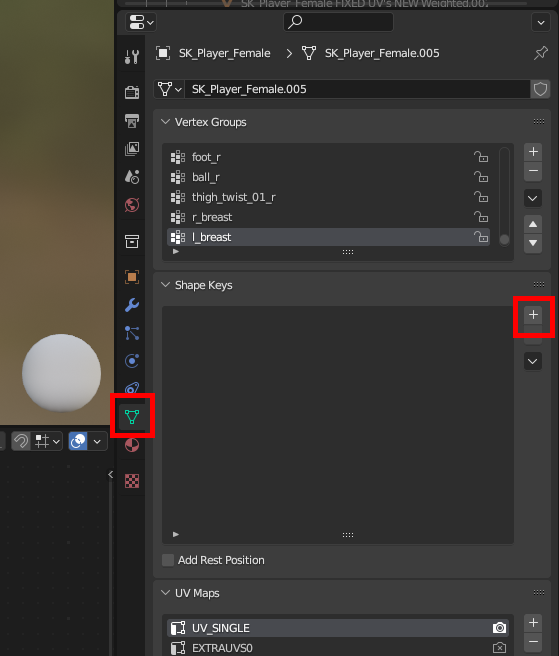
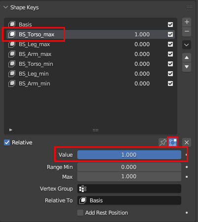
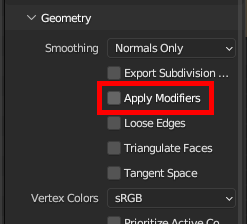
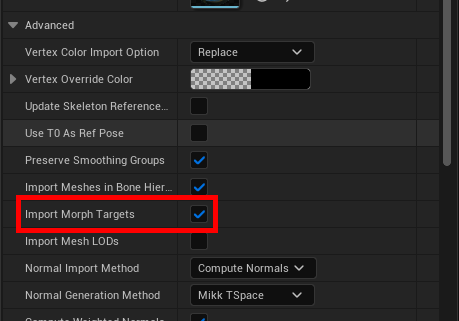

# Character Model Sliders

**Guide written by: `Dytser`**  

**Research contributed by: `FrancisLouis`**

For a while now it wasn't clear how the models handle the different shape sliders we can adjust at the start of the game. But after some research done on the discord its found out that Shape Keys is what's controlling this.  
However the downside is that despite now knowing what's controlling them, it would seem like the export from F model or importer into blender breaks these. So they have to be recreated.

## What's controlling it?
In order to make Shape Keys work you have to manually add these in blender.  
For each body bone there is a max and a min Shape Key controlling what happens when you go above or below 50% in the sliders.  
If you want to function for both lower values and higher than 50% you need to edit both.  

import { BiLogoBlender } from "react-icons/bi";

## <BiLogoBlender /> Inside Blender 

### Shape Key Groups

#### Maximum groups
| Body part | Shape Key name |
| --- |----------------| 
| Body | BS_Torso_max   |
| Legs | BS_Leg_max     |
| Arms | BS_Arm_max     |

#### Minimum Sliders
| Body part | Shape Key name |
| --- |----------------| 
| Body | BS_Torso_min   |
| Legs | BS_Leg_min     |
| Arms | BS_Arm_min     |

### Controlling your Shape Keys
### Adding Shape Keys
Select your model and go to the data tab.  
look beneath vertex groups section and click the + icon in the Shape Keys  
  
Now name them based on the table above.

### Editing Shape Keys
To edit your Shape Keys 
**select** the one you would like to edit, Set its value to **1** and make sure to click the **"Edit"** button.  

## Export and import into Unreal Engine
### Exporting from Blender
When exporting to FBX it's important to ensure that **"Apply Modifiers"** is turned off in the geometry tab.  

### Importing Into Unreal 5.11
When importing your FBX into Unreal make sure to go to  
**Mesh>Advanced**  
And toggle on the "Import Morph Targets" before importing  

### Testing your Shape Keys/Morph Targets
Open the mesh and click the morphs tab
