# Jiggle Physics ( 18+ )

**Guide written by: `Dytser`**

**Research by: `Lewdlad`, `Dytser`, `Francislouis`**  

import { MdNoAdultContent } from "react-icons/md";

## <MdNoAdultContent /> Minor NSFW warning
In this page there will be references and discussion to breast physics and one small example shown of physics on a character model.

## Jiggle Physics
### How do the work?
Jiggle physics in games are generally handled by a bone in the rig having physics attached to it, letting it move based on the momentum of the skeleton rather than any hardcoded/animated movement.

The way this is setup is by having bones on the model to handle this and then having parts of our model weighted to these bones.
More on this below.

In order to create and apply jiggle physics we need to do the following

* Prepare the 3D model
* Export the model correctly
 	* Recommended step: Preparing an animation and exporting it
* Importing the model into Unreal Editor
* Creating and working with the Animation BluePrint (ABP)
* Attaching the ABP to your model
* Exporting and packaging correctly.

All of these steps will be explained below

import { BiLogoBlender } from "react-icons/bi";

## <BiLogoBlender /> Blender

### Preparing the model
There is different ideas of how to best set something like this up, and it depends a lot on the individual how they approach it

#### Rigging
However, a general rule is to have 1 bone for each part you plan to have move, More bones = more detail, This is called a "chain". Depending on what way you want to apply the physics it can also help having an extra one which your physics bones are attached to, Basically a "bone_parent"

In this example I am adding jiggle physics to breasts of a character, so breast_l and breast_r are both parented to breast_parent which is in turn parented to the upper spine bone, In Palworlds case this would be Spine_3 for example.

#### Weight painting
Now that you have bones in your models character rig you need to give weight to the model to have it attach to the bones. Depending on how much you want them to have physics applied, you may want to start smaller.
The amount of weight applied depends entirely on what you are trying to add physics to.

#### Bodyparts
For things that are attached to the body such as breasts, butt, thigh, stomach, ears etc, You likely don't want to overdo it, I recommend starting small and increase from there if you want, For breast a good recommended weight would be 0.5 for example.

#### Detached Parts
For things not attached to a characters body (hair, clothing tassels, etc) you generally would like to go stronger as having the part be "static" wouldnt look realistic, And unlike body fat physics which generally is more for secondary motion detached parts are more or less "made" of physics.

For example having a keychain attached to a weapon with a figurine on the other end of the chain. we expect this figure to move and adhere to physics entirely rather than only partially like we do a body.

#### Exporting
Select all your meshes and the armature then export this as FBX.

#### Recommended step: Adding an animation 
This step can be skipped if you don't care, It can help to have some idea of how the animation will play out in the game instead of exporting it and constantly packaging it. Rebooting the game and recooking each time.

**Let's import an animation instead!**
You can either
* **A:** Make a custom animation, such as the rig moving up down and sideways quickly to show off movement and help you get an idea of how it will behave.  
* **B:** import an animation from the game.  

> For A:  
Just make your animation in blender, If you need instructions on that then you can refer to  

[First Steps in Blender Animation – A Comprehensive Tutorial](https://www.youtube.com/watch?v=PGvyBlgXHi8)  

For B:  
In FModel you can navigate to `Content/Pal/Animation`

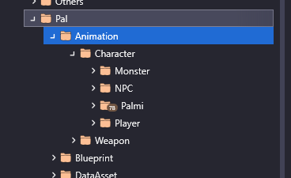  

Now simply find the animation of which you want to use, For example human `AS_Player_Female_Jog_None` and right click.  
Choose "Save Animation"  

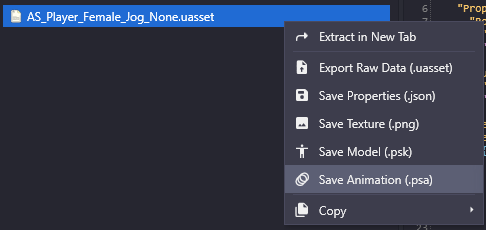  

Now if you go back to your blender project (you might want to save a copy just in case) you can now select your armature and then go to `File>Import>Import PSA`

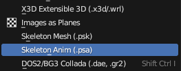  

After your animation is imported, if you play, it should now play the animation.  

You want to now go to the Dope Sheet by clicking the icon in the top right corner and changing this to the Dope Sheet.  
While in the dope sheet you will likely be presented with keyframes all over the place, What you really only care about is the starting and end keyframes.  
You can see in the next image the animation I imported starts at `0` and ends at `45`  
Now change the starting and end frames in the bottom right of the Dope Sheet to match the animation.  
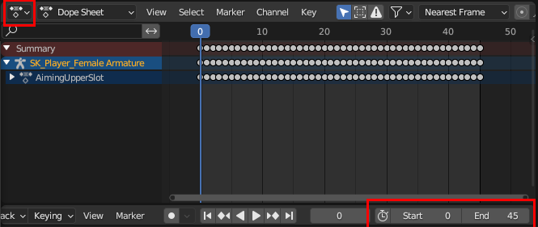  
Now if you play your animation it should loop.
With your animation created and setup in blender to loop correctly, You want to select your model + armature like usual and export to FBX  

#### FBX settings for animations:
Follow the usual FBX export settings. Such as turn off leaf bones etc

And under **Bake Animation** 
* Turn off both **NLA Strips** and **All actions**
* Make sure **Force Start/End Keyframes** and **Key All Bones** are toggled on

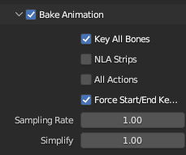  

import { SiUnrealengine } from "react-icons/si";

## <SiUnrealengine /> Unreal Engine
### Importing
Import the file like normal, Select the physicsasset and skeleton if its already in the project, Otherwise import them and place them according to their original File structure.

If you are unsure how to do that, Follow the instructions on
[Packaging final mod file through UE5](https://pwmodding.wiki/docs/asset-swapping/PackagingInUE5)

#### Importing The animation into Unreal
You import the animation just like how you import any other model, Just put it somewhere and direct its skeleton etc the way you do the other files.
I recommend naming them Anim that way you can easily find and know which files belong to the animations after cooking.

### Creating and Working with Animation Blueprints
Right-click your mesh in unreal. and go to `Create>Anim Blueprint` And name it whatever you want.  
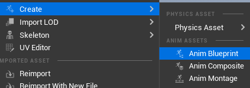  
This will create an Animation Blueprint next to your models skeleton file.
Now you want to right-click and add **Input pose** & **Spring Controller**

Attach the input pose into the spring controller and the spring controller into the output pose.
Unreal will auto create **Local to Component** nodes and attach them as intended in your setup.
Now you will want to give a spring controller for each physics bone you have.

For example this is my setup for Breast physics on my current model.  
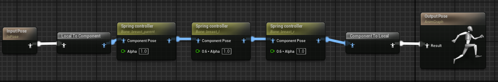  
Remember that physics goes from left to right in this case. So you would want your first node to be the left one, In this case i have breast Parent as the first node in my setup and every node thereafter is the two breast nodes attached to the parent.
The Left and Right breasts are not attached to each other so their order does not matter

### Compile
After you make changes, you will need to compile these in Unreal Editor. Click either the green button on the preview window Or the Compile button in the upper left corner above your preview window.

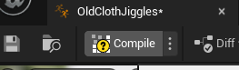

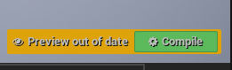  

Its important that you have **Input pose** as the first node and it all going into **Output pose** as the output when you later cook your files.

### Loading an animation in the preview

If you followed my recommended step and have an animation in unreal you can now right-click and go to `Animation>Sequence>play "animationname"`  
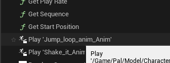  

Now simply attach it instead of the input pose into the load order and compile  
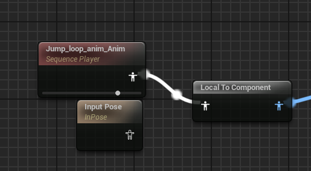  

Now if you look in your preview window you should see an animation going!  
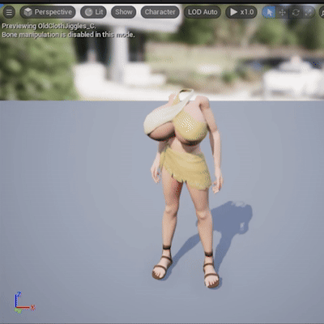  
With this you should have SOME idea how it will work ingame, Do note it won't be 1:1 when you actually get it ingame.

:::warning
### REMEMBER!
**You need to re attach the "Input Pose" and compile before cooking your project!**
:::

### Attaching the APB to the model
Double-click your model and scroll down past the **Mesh** Settings
Find the **Skeletal Mesh** dropdown and open it.
Inside you will find the option for **Post Process Anim Blueprint** Select your newly made ABP and save the model.
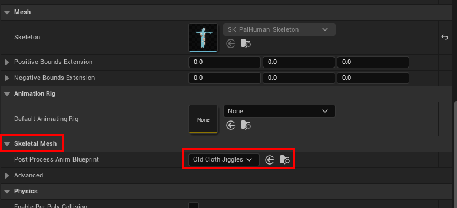  

Congratulations you now have added Jiggle Physics to your model
## Packaging the mod.
Follow packaging instructions like you would any other mod.
However, now with your ABP there will be the physics ABP file in your skeleton folder, You want to keep this for the mod.  
Navigate to `Content\Pal\Model\Character\Skeleton\Human` or wherever your skeleton would be stored.  
For example I named my ABP "oldClothJiggles".  So i now make sure to keep the `OldClothJiggles.uasset` and `OldClothJiggles.uexp` from the cooked folder when packaging the mod.

When in doubt remember: **Delete the skeleton. Keep the ABP**
It will attach to the bones on the mesh and since you didnt change the skeleton in the core of unreal it won't screw up the model ingame.
