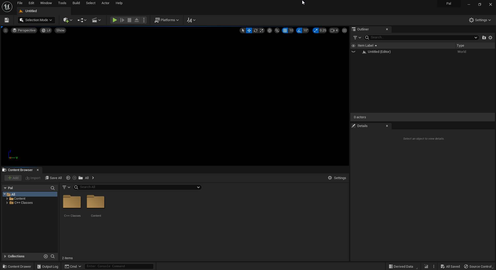
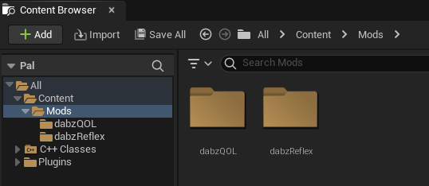
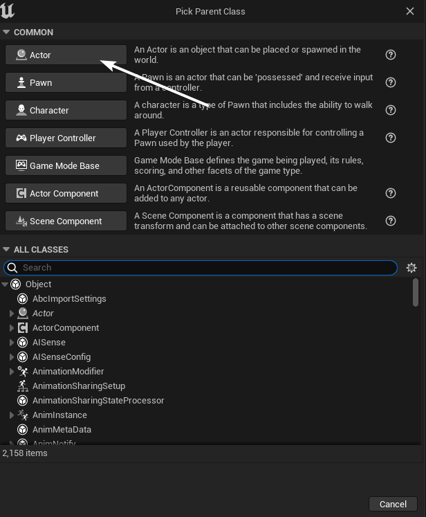
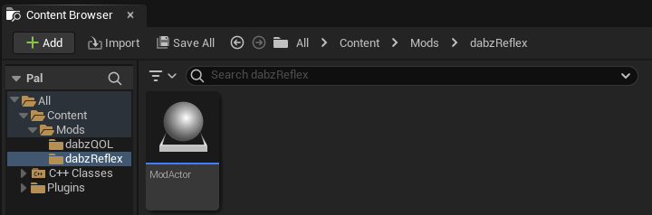
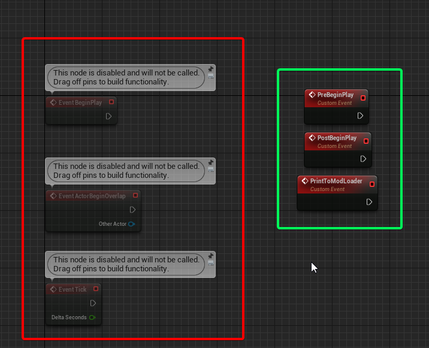
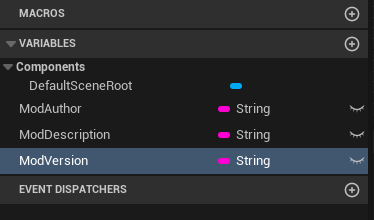
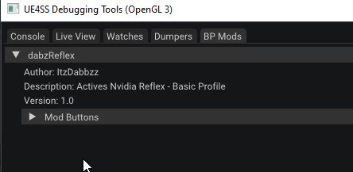

# Setting Up A Basic Mod

Where we left off would be Double-clicking `Pal.uproject`, You should see this screen

import { FaFile, FaFolder } from "react-icons/fa";
import { MdEvent, MdOutlineEventAvailable, MdOutlineEventBusy, MdInstallDesktop   } from "react-icons/md";

## <MdInstallDesktop/> ModActor Setup

1) In your `Content Browser` If there isn't a Folder ( <FaFolder/> ) named `Content` make one.
2) In `Content` make a Folder ( <FaFolder/> ) called `Mods` This is where any mod we make will be at.
3) Your folder structure should look similar below. (***Ignoring dabzQOL and dabzReflex***) 
4) Create a Folder ( <FaFolder/> )in `Mods` with the name you want your Mod's Pak file to be called. (In this case, I'll be using _*dabzReflex*_)
5) In that Folder ( <FaFolder/> ), We will be creating a new `Blueprint Class` that is a `Actor`. It will be called **_ModActor_** 
6) Now your Content Browser should look like so, next double-click your `ModActor` and make sure you are on the `Event Graph` tab 
7) Now your ModActor is technically setup, there is some more information to know about it below though.

## <MdEvent/> ModActor Events

import Tabs from '@theme/Tabs';
import TabItem from '@theme/TabItem';

<Tabs>
    <TabItem value="usedevents" label="Used Events" attributes={{className: 'usedevents'}} default>
        - ***PreBeginPlay*** - This event is too early to use to initialize your mod. ***(Only Works In ModActor)***
        - ***PostBeginPlay*** - This event is fired when the Player Controller Begin Play is called ***(Only Works In ModActor)***
            - The suggested event to use for initializing most things in your mod.
        - ***Event Tick*** - This event is fired every single tick.
            - This is commonly used if you need a event that is updating every single game tick
        - ***PrintToModLoader*** - Allows the ability to log to UE4SS Console through a blueprint. ***(Only Works In ModActor)***
            - To use this event, Create a `Custom Event` in your `ModActor` called `PrintToModLoader` exactly.
            - Add a initial String variable to this event, called `Message`. Leave the event alone now.
            - You can now call a new function called `Print To Mod Loader` anywhere.
        - ***ModMenuButtonPressed*** - Used to enable ModButtons in UE4SS's mod list area. ***(Only Works In ModActor)*** [ModButtons Tutorial](./mod-setup-buttons)
    </TabItem>
    <TabItem value="unusedevents" label="Unused Events" attributes={{className: 'unusedevents'}}>
        - ***EventBeginPlay***
        - ***EventActorBeginOverlap***

        

    </TabItem>
</Tabs>

## ModActor Variables

:::tip
ModActor variables are used to display information about your mod in UE4SS's loaded mod category.

They are simply just variables added to your blueprint, that are not used by your Blueprint, they are only used by UE4SS.

:::

- ***ModAuthor*** - Shows a Author in UE4SS Mods panel
- ***ModDescription*** - Shows a Description in UE4SS Mods Panel
- ***ModVersion*** - Shows a Version in UE4SS Mods Panel