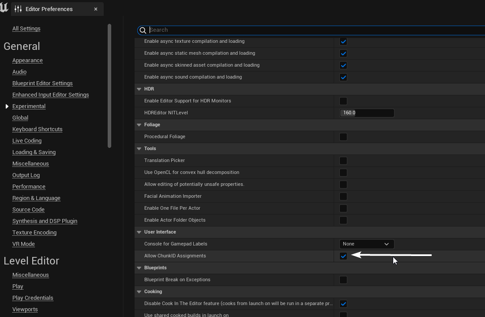
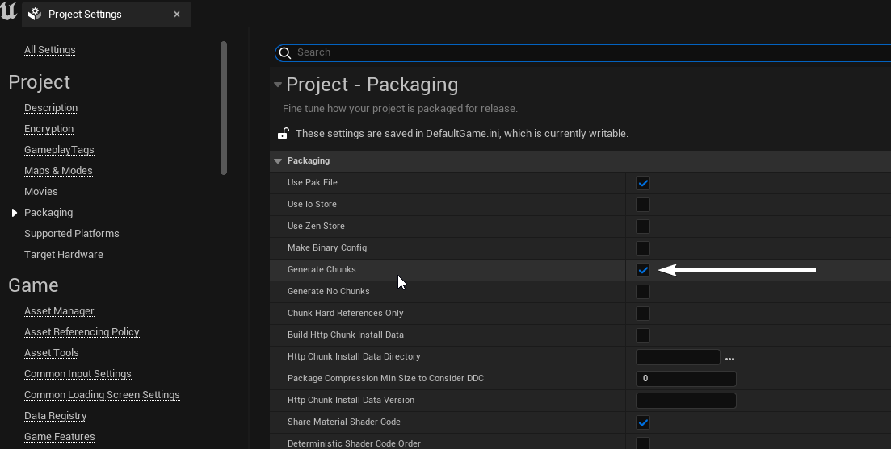
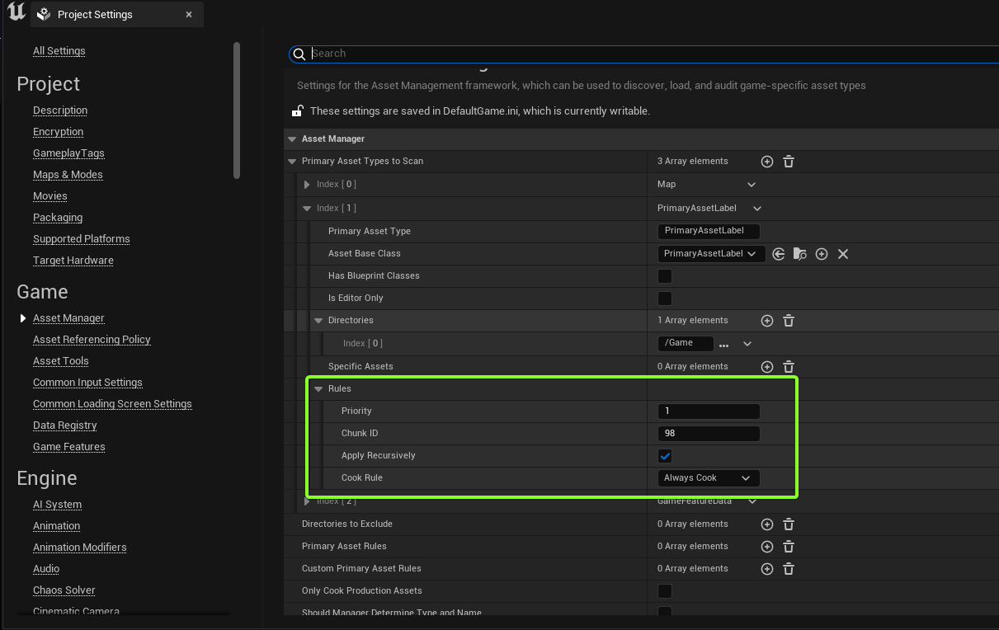
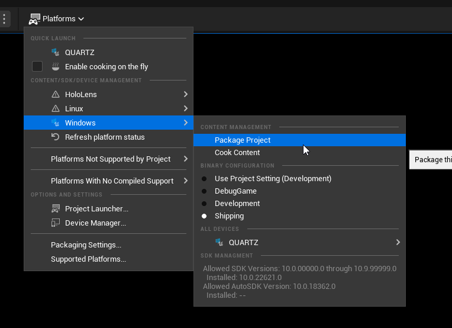
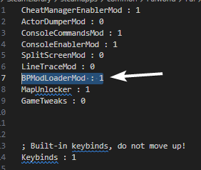

# 导出项目

:::note
请确保这2个设置开启

:::

1、创建1个数据资产（标记为“主要资产标记（Primary Asset Label）”），命名为在你的内容文件夹中的模组文件夹名称。设置优先级为`1`，并指定块ID为好记的数字（不应该为0）。
2、设置你的模组资产（`ModActor`蓝图类以及所有你想要包括进模组的资产）的文件块ID为上步骤所指定的数字。
3、转到**项目设置→资产管理器**并检查你的设置符合以下图片的设置（确保设置的格式和你创建的主要资产标记（Primary Asset Label）相同 ）。 
4、只要所有文件块ID匹配你要打包的每个模组文件，便可以打包你的项目啦。  它可能会花费很长时间，因为需要烘焙与编译所有东西。
5、打包成功后，你应该会见到，有1个`pakchunk{你指定的文件块ID}-Windows.pak`在你所指定的Pak输出文件夹。将它命名为虚幻引擎中`ModActor`父文件夹的名称。至此，你的模组终于完成啦！

    
若你只得到`pakchunk0-Windows.pak`，而没有你指定的ID

    

        进入**项目设置→打包** 
        然后勾选“烘焙在项目的内容文件夹中的一切（忽略地图以下的列表）”。 
        
    

:::tip
记得在`Palworld\Pal\Binaries\Win64\Mods\mods.txt`中开启UE4SS的`BPModLoader`。

译者提示：若你在模组中使用了函数，亦需要启用`BPML_GenericFunctions`。
:::