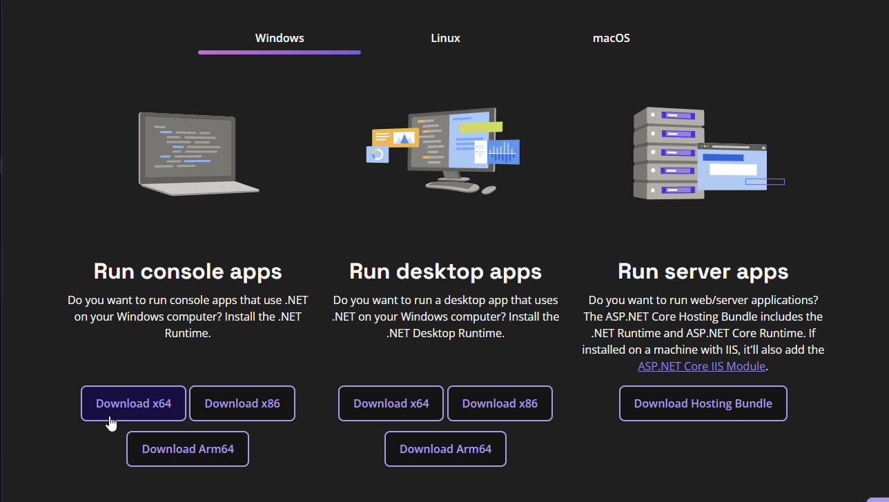
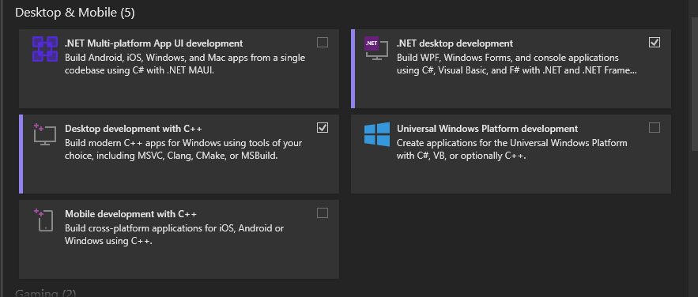
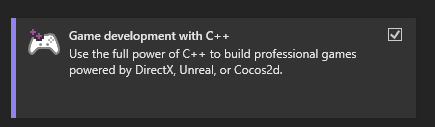
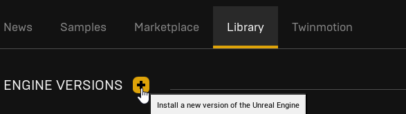
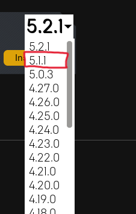
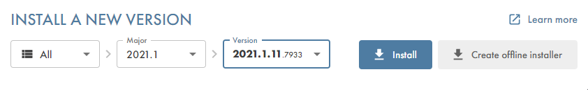
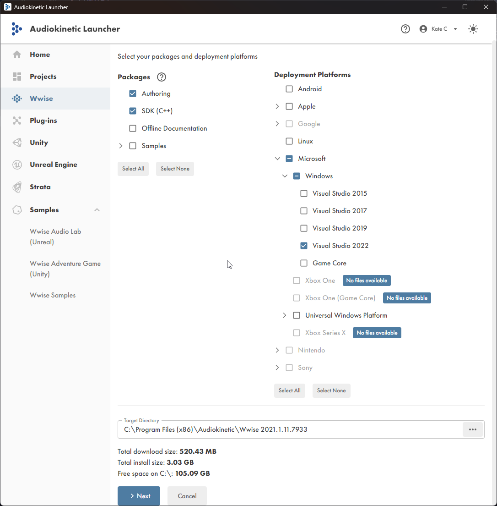
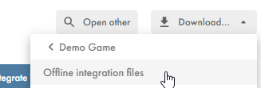

# 第一部分 先决条件

## .NET 6

import { FaDownload } from "react-icons/fa6";

为了虚幻构建工具（Unreal Build Tools）正常工作，你需要在你的系统中安装.NET 6。

[下载 <FaDownload />](https://dotnet.microsoft.com/zh-cn/download/dotnet/6.0/runtime?cid=getdotnetcore&os=windows&arch=x64)

点击`运行桌面应用`标题下的`下载 x64`按钮来下载运行时：

下载好安装器后，只需打开并安装它。

## Visual Studio 2022

为了编译SDK，你还必须有Visual Studio 2022（即使因其它版本，也不可使用）。

[下载 <FaDownload />](https://visualstudio.microsoft.com/vs/) 

只需要安装`社区版`即可。以上链接将会使你下载它的安装器，在打开安装器后，需要确保以下组件安装。

- .NET桌面开发
- 使用C++的桌面开发
- 使用C++的游戏开发
- 通用Windows平台开发

接着，点击`继续`，然后等待它安装完毕。

:::note
译者提示：位于中国大陆地区的用户的下载速度可能极慢，请考虑使用虚拟专用网络或代理服务器进行下载。
:::

import { FaCirclePlus } from "react-icons/fa6";
import Highlight from '@site/src/components/Highlight';

## 虚幻引擎5.1

在安装完成Visual Studio后，我们还需要安装虚幻引擎。

下载虚幻引擎，可以通过编译源代码，或通过Epic Games平台下载。此处使用Epic Games下载。

1、打开Epic Games启动器。
2、转到`虚幻引擎`选项卡。
3、转到`库`标签页。
4、按下<Highlight color="#dea309">金色的 <FaCirclePlus /> 按钮</Highlight>，以添加1个新的版本。

5、你应该可以看到，1个新的卡片出现了。并且可以选择版本。
6、选择`5.1`系列版本。

:::warning
任何带有`5.1`前缀的版本都可以使用，无论是`5.1`还是`5.1.1`。
:::

## Wwise

《幻兽帕鲁》使用[Wwise](https://www.audiokinetic.com/zh/products/wwise/)来处理声音资产，因此我们也需要安装它。

:::danger
即使你并未打算制作声音相关的模组，你也需要安装它，否则将无法编译模组。
:::

1、为了下载[Wwise](https://www.audiokinetic.com/zh/products/wwise/)，可以先安装它的启动器，只需要点击`下载Audikinetic Launcher`。

[下载 <FaDownload />](https://www.audiokinetic.com/zh/download)

:::note
你需要注册1个账号。
:::

2、在下载完成后，安装它，并登录你的账号。
2、转到`Wwise`选项卡。
3、在右侧界面的左下角，应该有1个标为`Install A New Version`（安装1个新的版本）的部分。
4、在那里选择版本，只可选择`2021.1.11`作为你的[Wwise](https://www.audiokinetic.com/zh/products/wwise/)版本，然后点击`Install`（安装）来安装。

:::info
在下个界面中，选中这些内容：

- SDK (C++)
- Microsoft → Windows → Visual Studio 2022
:::

现在应该看起来像这样子：

5、然后点击`Next`（下一步），在这个界面不需要做任何事，所以点击`Install`就好啦！
6、在安装好[Wwise](https://www.audiokinetic.com/zh/products/wwise/) SDK后，转到`Unreal Engine`（虚幻引擎）选项卡。
7、点击 <FaDownload /> 按钮，并选择`Offline Integration Files`（离线交互文件）。

8、在`Integration Version`（交互插件版本）中，选择`2021.1.11`版本，然后选择一个你可以记住的路径，直接安装吧。

### 完成

:::note
你将会用到那个路径中的文件，所以请记住它们的位置。
:::