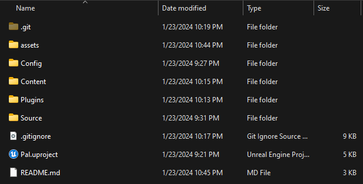
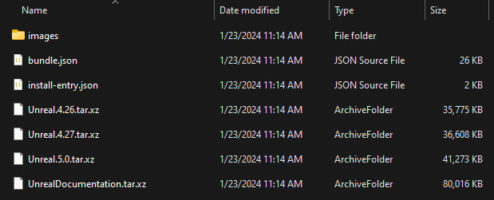
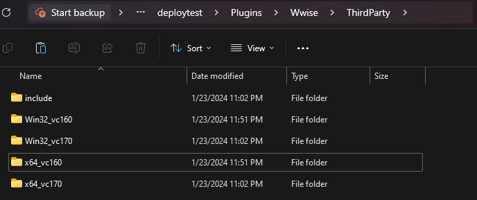
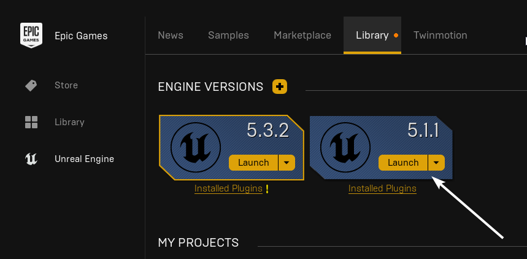

# 第二部分 安装并配置《幻兽帕鲁》模组制作工具包

:::info
《幻兽帕鲁》模组制作工具包的英文名为 _Palworld_ Modding Kit，缩写为 **<abbr>PDK</abbr>** 。

它在本教程中可能也会被称为“SDK”。
:::

随着预备条件准备完毕，我们亦能够下载模组制作工具包了。

## 从仓库下载

有2种方式来下载仓库中的内容。

* 通过Git克隆
* 下载Zip文件

通过Git克隆的方式有个优势，可以方便地进行PDK更新，但需要一些基本的Git使用知识。接下来将给出这2种方式的指导。

### 通过Git克隆

若需要使用Git克隆仓库，你需要仓库的链接：https://github.com/localcc/PalworldModdingKit。

使用`git clone`命令：

```bash title="Git"
git clone https://github.com/localcc/PalworldModdingKit
```

### 下载Zip文件

若你不想使用Git，只想简单地下载PDK，你可以使用下面的按钮来下载：

import GitHubButton from '@site/src/components/GitHubButton';

<GitHubButton text="下载PDK" url="https://github.com/localcc/PalworldModdingKit/archive/HEAD.zip"/>

在下载完成后，只需要解压它便好啦。

### 进行检查

在下载仓库内容后，你应该可以看到以下所示的文件夹结构：



## 接入Wwise

:::warning
在使用虚幻引擎打开SDK之前，我们必须手动安装Wwise。这是因为这个Wwise版本，官方并未使它与当前的虚幻引擎版本（`5.1`系列版本）兼容，所以我们又需要复制文件了。
:::

1、打开你在[上个教程](./install-part-1#完成)中下载Wwise的位置。如果成功安装，你应该可以看到以下文件夹结构。



2、解压`Unreal.5.0.tar.xz`压缩包。

:::note
你可能需要解压2次（如果你的解压软件不会自动识别Tgz文件），第1次会得到1个Tar文件，再解压它。
:::

import { FaFile, FaFolder } from "react-icons/fa";

3、复制解压后的`Wwise`文件夹（<FaFolder/>）到SDK的`Plugins`文件夹

4、Wwise的操作已经快要完成了呢，现在只需要复制一些它需要的Dll文件。

5、打开位于SDK中的`Wwise`文件夹（<FaFolder/>），并创建1个`ThirdParty`文件夹。

6、现在转到你SDK所在的文件夹（<FaFolder/>）。

:::warning
不是你安装那些交互文件的文件夹，而是Wwise SDK所在的文件夹。
:::

```text title="默认Wwise SDK位置"
C:\Program Files (x86)\Audiokinetic\Wwise 2021.1.11.7933\SDK
```

在那个文件夹中（<FaFolder/>），选中这些文件夹：

* `Win32_vc170`
* `x64_vc170`
* `include`

7、复制以上列出的文件夹（<FaFolder/>）到你刚刚创建的`ThirdParty`文件夹。

8、在在复制完毕后，确保再复制带有`vc170`字样的文件夹，然后将它改为`vc160`，最后应该看起来像这样：



:::info
以下部分的操作是可选的。

如果你不遵循下面的步骤，将会每次在打开PDK的项目文件后弹出1个信息框，它应该会说，“Wwise不与当前的虚幻引擎版本兼容（Wwise is not compatible with the current Unreal Engine version）”。

为了修复它，打开SDK文件夹中的`Plugins\Wwise`文件夹，使用文本编辑器打开`Wwise.uplugin`文件。

然后更改`"EngineVersion" : "5.0.0",`为`"EngineVersion" : "5.1",`即可。
:::

### 完成

好耶！现在已经完成交互文件的操作啦。

## 将编译工具从Visual Studio 2019改为Visual Studio 2022
在虚幻引擎的5.1版本中，默认情况下，若Visual Studio 2019被安装，则会使用它。

:::warning
以下操作应该只在Visual Studio 2019与Visual Studio 2022一并存在时才需要做。
:::

:::note
译者提示：你可能之前安装过Visual Studio 2019，且之后并未完全删除（比如这里）。此处建议：若在打开项目文件时出错，请尝试做这些操作。
:::

<details>
    <summary>如果你并没有看到“Unreal Engine”在`%APPDATA%`中</summary>
    <div>
        如果你并没有看到“Unreal Engine”在`%APPDATA%`中，这说明你在安装虚幻引擎后并没有启动过它。<br/>
        做以下操作：Epic Games启动器→虚幻引擎→库，点击在你下载的虚幻引擎上的“启动”按钮即可。<br/>
        <br/>
        等它初始化完成，直到你看到出现“新项目”窗口。关闭它，然后继续教程。<br/>
    </div>
</details>

为了修改文件，打开`%APPDATA%\Unreal Engine\UnrealBuildTool`文件夹并使用你喜欢的任何文本编辑器打开`BuildConfiguration.xml`。


```xml title="未改动的文件"
<?xml version="1.0" encoding="utf-8" ?>
<Configuration xmlns="https://www.unrealengine.com/BuildConfiguration">
</Configuration>
```


```xml title="将文件的内容更改为以下内容："
<?xml version="1.0" encoding="utf-8" ?>
<Configuration xmlns="https://www.unrealengine.com/BuildConfiguration">
    <VCProjectFileGenerator>
        <Version>VisualStudio2022</Version>
    </VCProjectFileGenerator>
    <WindowsPlatform>
        <Compiler>VisualStudio2022</Compiler>
    </WindowsPlatform>
</Configuration>
```

:::tip
恭喜你！终于配置完成啦。
:::

