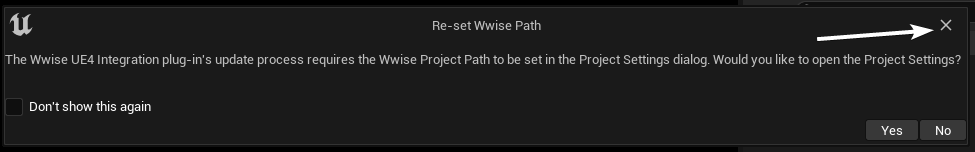

# 第三部分 启动PDK

## 在做完前面的一系列操作后，我们，终于准备好啦！ 

## 双击`Pal.uproject`，然后它应该会在虚幻引擎中打开。

:::note
若提示“模块已过期（Modules are out of date）”，需要重新编译（Recomile），点 **`YES`** 就好
:::

:::note
译者提示：若它提示“无法编译Pal模块（Pal could not be compiled）”，请确保使用Visual Studio 2022进行编译，或者尝试遵循[上篇教程中的操作](./install-part-1#将编译工具从visual-studio-2019改为visual-studio-2022)。
:::

:::warning
Windows系统非常讨厌长的路径。**若它还是告诉你“有模块需要重新编译”，可能是你的路径太长了。**
如果你之前下载PDK的方式是下载Zip文件，而非Git克隆，这确实会出现。尝试重命名`PalworldModdingKit`文件夹，并移除在其中的任何`-`符号。或者可以试着将它移动到更靠近根目录的文件夹。

译者提示：除此之外，可以通过一些方法，取消长路径限制。
:::

:::warning
不兼容的Wwise版本，将会使虚幻引擎在每次启动SDK时弹窗，只要点击 **YES** 便可以啦。
:::

:::warning
如果虚幻引擎没有被打开，而是弹出”打开方式“窗口，便需要打开虚幻引擎，从那里打开项目。
:::

:::note
你可能在启动时会看到1个弹窗，关于Wwise路径问题，不用点击右下角的按钮，只需点击左上角的“×”便可。

:::

:::danger
在打开时，虚幻引擎可能没有出现，因为它需要在后台编译很多很多东西。这可能会花费较长时间，取决于你的电脑性能。

译者提示：如果你真的想要查看进度，可以通过查看`Pal\Saved\Pal.log`日志文件，使用会自动刷新文件内容的文本编辑器会有更好的体验（例如Visual Studio Code）。
:::
